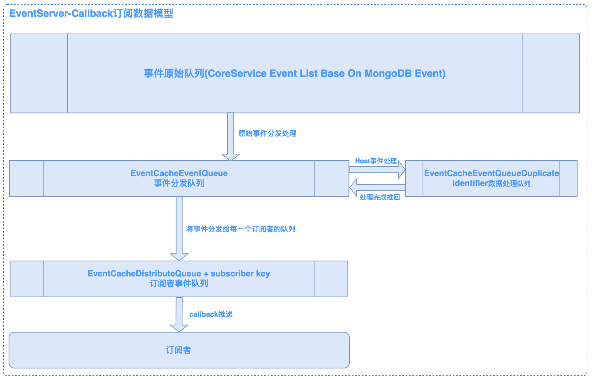
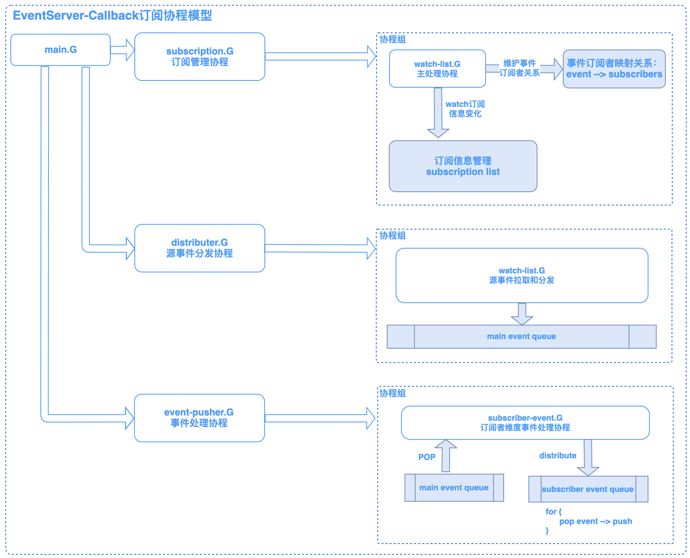

CMDB EventServer事件服务模块
============================

# 概述

* 基于回调模式的事件订阅与推送;
* 基于Watch模式的事件监听;

# 模块架构

* `拉取数据源`: 基于资源控制层CoreService事件机制，将底层数据库数据事件同步到全局缓存队列, 事件服务基于游标进行watch拉取;
* `写入事件队列`: 事件服务整体为主从模式（除主机身份时间处理逻辑外），Master节点的事件源watcher将事件同步到事件队列;
* `分发到订阅者事件队列`: 事件处理协程将事件队列中的事件根据订阅者关系分发到指定订阅者的队列中，之后Pusher协程则会讲事件发送到目标订阅者;

## 协程模型

* `订阅信息管理`: 基于资源控制层事件机制，对系统内的订阅信息进行动态管理;
* `事件订阅关系`：事件分发最终以订阅者维度进行推送，系统会基于动态的事件订阅信息维护订阅者列表，即指定事件类型对应一个订阅者列表;
* `事件推送`: 事件处理协程将事件队列中的事件根据订阅者关系分发到指定订阅者的队列中，之后Pusher协程则会讲事件发送到目标订阅者;
* `事件过期`: 资源控制层事件机制保持一定时间的数据缓存（默认6小时），同样事件服务也对事件进行过期判断，对事件队列进行积压清理;

# FAQ
