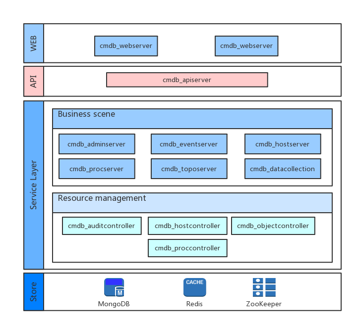

# 蓝鲸智云配置平台的架构设计

 

蓝鲸智云配置平台（以下简称配置平台）整体为分层的微服务设计，可以分为以下四层：

1. **资源层（store）**：提供系统所需的资源存储、消息队列以及缓存系统服务

2. **服务层(service layer)**： 服务层划分为两大模块

    1. **资源管理模块**： 在配置平台中我们把资源类型进行了抽象，提供原子接口服务，支持横向扩展，每一类资源由一类微服务进程来管理。
    
    
    2. **业务场景模块**： 业务场景模块是基于资源管理模块的原子接口对应用场景的封装，基于操作的相关度，目前划分出【admin、auth、cloud、datacollection、operation、host、process、synchronize、task、topo】几个微服务。
      - admin服务负责系统的配置刷新、初始化数据写入等操作；
      - event服务负责系统的事件订阅与推送服务；
      - process、topo、host、cloud分别负责系统进程、拓扑模型、主机、云数据的使用场景；
      - datacollection 服务负责系统快照数据的接收与写入；
      - operation 服务提供与运营统计相关功能；
      - synchronize 服务提供数据同步功能；
      - auth 服务提供权限相关功能；
      - task 服务提供异步任务管理。

3. **接口层(api)**： 这一层是系统的api服务网关。

4. **web层(web)**： web层是系统提供的web服务。通过配置平台提供的web服务界面，用户可以进行资源的操作。

在架构图中有一点未体现出来的就是连接所有系统微服务的服务发现功能，基于zookeeper node watch 机制，我们构建了系统的服务注册与发现功能，从而使系统能保持高可用。 

为了规避微服务部署中配置文件的管理问题，我们基于zookeeper 构建了系统的配置中心服务，所有的配置文件在系统启动之初就通过admin-server 刷入 zookeeper ，每个进程只需要在zookeeper 中取自己需要的配置文件。
这两个模块的存在保证了系统的高可用以及服务的易用性。
