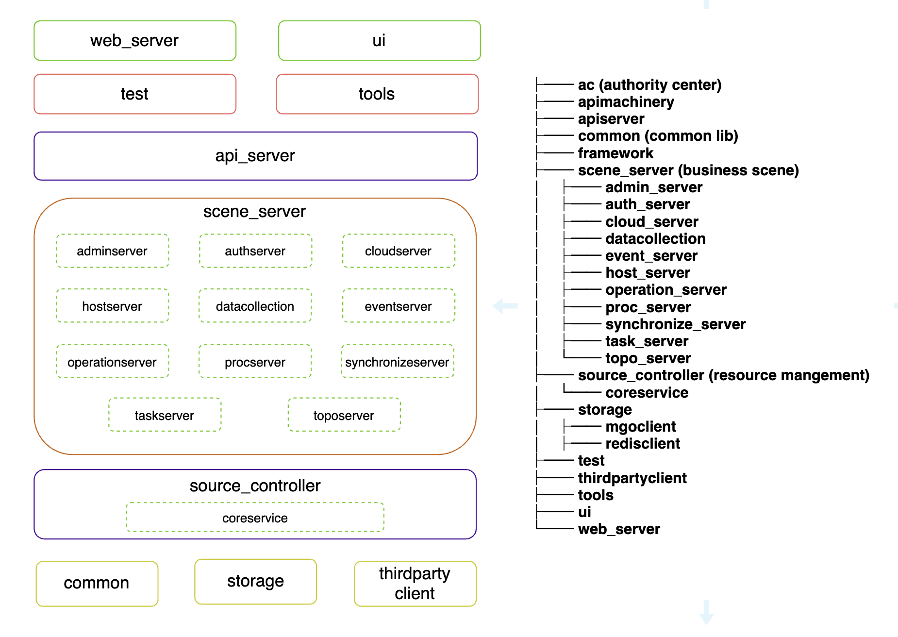

# 蓝鲸智云配置平台的代码结构

 

## 1. web-server & ui

web-server是基于gin打造的web服务器， ui目录基于vue.js构建

## 2. test & tools

test 目录为系统服务的调用示例，tools 目录为客户端管理工具和辅助脚本工具

## 3. api_server

api-server基于开源go-restful 框架构建

## 4. scene_server

scene_server基于go-restful框架构建，以下为划分的微服务目录：
* admin_server
* auth_server
* cloud_server
* datacollection
* event_server
* host_server
* operation_server
* proc_server
* synchronize_server
* task_server
* topo_server

## 5. source_controller

source_controller基于go-restful框架构建，提供提供原子接口服务

## 6. common & storage & 
common 目录为项目的公共依赖库，storage是项目对存储接入的封装，thirdpartyclient是项目对第三方客户端接入的封装
