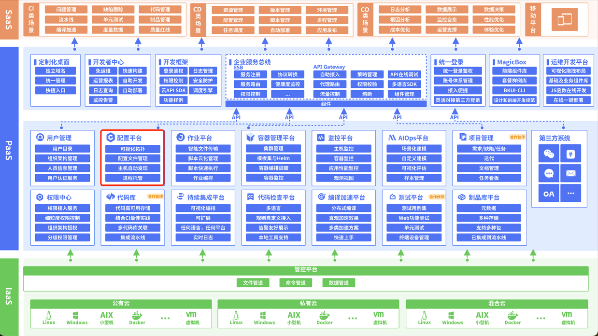

# 了解蓝鲸配置平台和蓝鲸社区版

------

## 开源蓝鲸配置平台和蓝鲸社区版的关系

- 蓝鲸智云（简称蓝鲸）是一套基于PaaS的技术运营体系，蓝鲸社区版是蓝鲸智云其中免费对外开放的版本，蓝鲸智云还有企业版、公有云版；点击了解更多关于蓝鲸智云：http://bk.tencent.com/

- 蓝鲸配置平台是蓝鲸社区版中的一个基础平台，可见下图CMDB在社区版体系架构中的位置。

 

## 如何体验蓝鲸配置平台以及蓝鲸社区版？

- **单机部署**一套简易蓝鲸社区版（主要包含蓝鲸PaaS、蓝鲸配置平台，蓝鲸作业平台几个基础平台）
  - 自己准备资源部署体验：http://docs.bk.tencent.com/bkce_install_guide/install_on_single_host.html
  - 在线使用腾讯云实验室部署体验（体验时间只有一个小时，也可直接购买变为长期体验环境）：https://cloud.tencent.com/developer/labs/lab/10386
- **部署完整的社区版**体验（包含所有蓝鲸的基础平台、SaaS应用等）
  - 社区版下载地址：http://bk.tencent.com/download/
  - 部署指引：http://docs.bk.tencent.com/bkce_install_guide/

- **开源独立部署**（目前已推出容器化部署，GitHub上的release版本会跟社区版大版本集成的配置平台保持同步更新）：https://github.com/Tencent/bk-cmdb#getting-started
