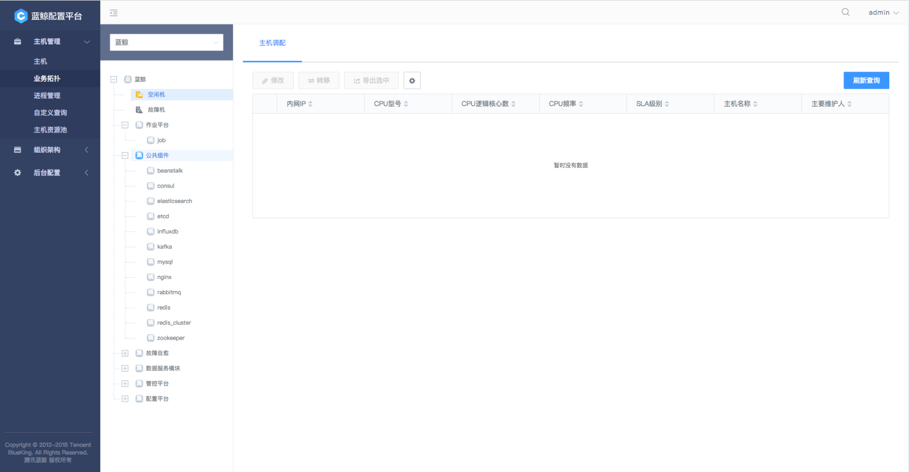

# CMDB 部署文档

## 依赖第三方组件

* ZooKeeper >= 3.4.11
* Redis   >= 3.2.11
* MongoDB >= 2.8.0
* Elasticsearch >= 5.0.0 & < 7 (用于全文检索功能，推荐使用5.x的版本)
* Mongo-connector >= 2.5.0 (用于全文检索功能，推荐3.1.1)

## CMDB 微服务进程清单

### 1. web层服务进程
* cmdb_webserver

### 2. 服务网关进程
* cmdb_apiserver


### 3. 场景层服务进程
* cmdb_adminserver
* cmdb_eventserver
* cmdb_hostserver
* cmdb_procserver
* cmdb_toposerver
* cmdb_datacollection

### 4. 资源管理服务进程
* cmdb_auditcontroller
* cmdb_hostcontroller
* cmdb_objectcontroller
* cmdb_proccontroller

---

## 部署介绍
### 1. 部署ZooKeeper

请参看官方资料 [ZooKeeper](https://zookeeper.apache.org/doc/current/zookeeperAdmin.html#ch_deployment)

推荐版本下载： [ZooKeeper 3.4.12](https://mirrors.tuna.tsinghua.edu.cn/apache/zookeeper/zookeeper-3.4.12/zookeeper-3.4.12.tar.gz)

### 2. 部署Redis

请参看官方资料 [Redis](https://redis.io/download)

推荐版本下载： [Redis 3.2.11](http://download.redis.io/releases/redis-3.2.11.tar.gz)


### 3. 部署MongoDB

请参考官方资料 [MongoDB](https://docs.mongodb.com/manual/installation/)

推荐版本下载：[MongoDB 2.8.0](http://downloads.mongodb.org/linux/mongodb-linux-x86_64-rhel70-2.8.0-rc5.tgz?_ga=2.109966917.1194957577.1522583108-162706957.1522583108)

### 4. Release包下载

官方发布的 **Linux Release** 包下载地址见[这里](https://github.com/Tencent/bk-cmdb/releases)。如果你想自已编译，具体的编译方法见[这里](source_compile.md)。

### 5. 配置数据库

1. Redis需要打开auth认证的功能，并为其配置密码
2. 安装MongoDB后，创建数据库 cmdb
3. 为新创建的数据库设置用户名和密码

> MongoDB 示例:

登陆MongoDB后执行以下命令:

``` json
 > use cmdb
 > db.createUser({user: "cc",pwd: "cc",roles: [ { role: "readWrite", db: "cmdb" } ]})
```

**注：以上用户名、密码、数据库名仅作示例展示，用户使用中可以更具实际情况自行配置。如果安装的MongoDB的版本大于等于3.6，需要手动修改init.py自动生成的配置文件，详细步骤参看init.py相关小节。**

详细手册请参考官方资料 [MongoDB](https://docs.mongodb.com/manual/reference/method/db.createUser/)

### 6. 部署Elasticsearch (用于全文检索, 可选, 控制开关见第9步的full_text_search)

官方下载 [ElasticSearch](https://www.elastic.co/cn/downloads/past-releases)
搜索5.x的版本下载，推荐下载5.0.2, 5.6.16
下载后解压即可，解压后找到配置文件config/elasticsearch.yml，可以配置指定network.host为
具体的host的地址
然后到目录的bin目录下运行(注意，不能使用root权限运行，要普通用户)：
```
./elasticsearch
```

如果想部署高可能可扩展的ES，可参考官方文档[ES-Guide](https://www.elastic.co/guide/index.html)

### 7. 部署mongo-connector (用于全文检索, 可选, 控制开关见第9步的full_text_search)

官方仓库 [Mongo-connector](https://github.com/yougov/mongo-connector)
推荐使用pip安装：

```
pip install elastic2-doc-manager elasticsearch
pip install 'mongo-connector[elastic5]'
```

下载后请检查python包版本，尤其python elasticsearch大版本要和下载的elasticsearch一致

配置配置文件config.json(配置说明参见[config](https://github.com/yougov/mongo-connector/wiki/Configuration%20Options)):

主要配置
key前面添加__代表忽略此配置
mainAddress指定mongo，如果是mongo集群，可以指向slave节点
authentication暂时先别配置，认证有问题
namespaces里面配置要同步的mongo里的table，false代表不同步，true代表同步,
可以自行配置需要同步哪些table用于全文检索

```
{
    "__comment__": "Configuration options starting with '__' are disabled",
    "__comment__": "To enable them, remove the preceding '__'",

    "mainAddress": "127.0.0.1:27017",
    "oplogFile": "/var/log/mongo-connector/oplog.timestamp",
    "noDump": false,
    "batchSize": -1,
    "verbosity": 3,
    "continueOnError": true,

    "logging": {
        "type": "file",
        "filename": "/var/log/mongo-connector/mongo-connector.log",
        "format": "%(asctime)s [%(levelname)s] %(name)s:%(lineno)d - %(message)s",
        "rotationWhen": "D",
        "rotationInterval": 1,
        "rotationBackups": 10,

        "__type": "syslog",
        "__host": "localhost:514"
    },

    "__authentication": {
        "adminUsername": "cc",
        "password": "cc",
        "__passwordFile": "mongo-connector.pwd"
    },

    "__fields": ["field1", "field2", "field3"],
    
    "exclude_fields": ["create_time", "last_time"],

    "namespaces": {
        "cmdb.cc_HostBase": true,
        "cmdb.cc_ObjectBase": true,
        "cmdb.cc_ObjDes": true,
        "cmdb.cc_ApplicationBase": true,
        "cmdb.cc_OperationLog": false
    },

    "docManagers": [
        {
            "docManager": "elastic2_doc_manager",
            "targetURL": "127.0.0.1:9200",
            "__bulkSize": 1000,
            "uniqueKey": "_id",
            "autoCommitInterval": 0
        }
    ]
}
```

然后运行命令启动：
```
mongo-connector -c config.json
```

也可以自己写成system服务来运行

### 8. 部署CMDB

编译后下载 **cmdb.tar.gz**

在目标机上解压包解**cmdb.tar.gz**，解压后根目录结构如下：

``` shell
-rwxrwxr-x 1 1004 1004 1.2K Mar 29 14:45 upgrade.sh
-rwxrwxr-x 1 1004 1004  312 Mar 29 14:45 stop.sh
-rwxrwxr-x 1 1004 1004  874 Mar 29 14:45 start.sh
-rwxrwxr-x 1 1004 1004  28K Mar 29 14:45 init.py
-rwxrwxr-x 1 1004 1004  235 Mar 29 14:45 init_db.sh
-rwxrwxr-x 1 1004 1004  915 Mar 29 14:45 image.sh
drwxrwxr-x 2 1004 1004 4.0K Mar 31 14:45 web
drwxrwxr-x 2 1004 1004 4.0K Mar 29 14:45 docker
drwxrwxr-x 3 1004 1004 4.0K Mar 29 14:45 cmdb_adminserver
drwxrwxr-x 3 1004 1004 4.0K Mar 29 14:45 cmdb_webserver
drwxrwxr-x 3 1004 1004 4.0K Mar 29 14:45 cmdb_apiserver
drwxrwxr-x 3 1004 1004 4.0K Mar 29 14:45 cmdb_toposerver
drwxrwxr-x 3 1004 1004 4.0K Mar 29 14:45 cmdb_procserver
drwxrwxr-x 3 1004 1004 4.0K Mar 29 14:45 cmdb_hostserver
drwxrwxr-x 3 1004 1004 4.0K Mar 29 14:45 cmdb_eventserver
drwxrwxr-x 3 1004 1004 4.0K Mar 29 14:45 cmdb_datacollection
drwxrwxr-x 3 1004 1004 4.0K Mar 29 14:45 cmdb_proccontroller
drwxrwxr-x 3 1004 1004 4.0K Mar 29 14:45 cmdb_objectcontroller
drwxrwxr-x 3 1004 1004 4.0K Mar 29 14:45 cmdb_auditcontroller
drwxrwxr-x 3 1004 1004 4.0K Mar 29 14:45 cmdb_hostcontroller
```

各目录代表的服务及职责：

|目标|类型|用途描述|
|---|---|---|
|upgrade.sh|script|用于全量升级服务进程|
|stop.sh|script|用于停止所有服务|
|start.sh|script|用于启动所有服务|
|init.py|script|用于初始化服务及配置项，在需要重置服务配置的时候也可以运行此脚本，按照提示输入配置参数|
|init_db.sh|script|初始化数据库的数据|
|image.sh|script|用于制作Docker镜像|
|web|ui|CMDB UI 页面|
|docker|Dockerfile|各服务的Dockerfile模板|
|cmdb_adminserver|server|负责系统数据的初始化以及配置管理工作|
|cmdb_webserver|server|web server 服务子目录|
|cmdb_apiserver|server|场景层服务，api 服务|
|cmdb_toposerver|server|场景层服务，负责模型的定义以及主机、业务、模块及进程等实例数据的维护|
|cmdb_procserver|server|场景层服务，负责进程数据的维护|
|cmdb_hostserver|server|场景层服务，主机数据维护|
|cmdb_eventserver|server|场景层服务，事件推送服务|
|cmdb_datacollection|server|场景层服务，数据采集服务|
|cmdb_proccontroller|controller|进程资源数据维护基础接口|
|cmdb_objectcontroller|controller|模型数据维护接口|
|cmdb_auditcontroller|controller|审计数据维护服务|
|cmdb_hostcontroller|controller|主机数据维护服务|

### 9. 初始化

假定安装目录是 **/data/cmdb/**

进入安装目录并执行初始化脚本，**按照提示输入参数**。

``` shell
[root@SWEBVM000229 /data/cmdb]# python init.py

	usage:
	--discovery           <discovery>           the ZooKeeper server address, eg:127.0.0.1:2181
	--database           <database>             the database name, default cmdb
	--redis_ip           <redis_ip>             the redis ip, eg:127.0.0.1
	--redis_port         <redis_port>           the redis port, default:6379
	--redis_pass         <redis_pass>           the redis user password
	--mongo_ip           <mongo_ip>             the mongo ip ,eg:127.0.0.1
	--mongo_port         <mongo_port>           the mongo port, eg:27017
	--mongo_user         <mongo_user>           the mongo user name, default:cc
	--mongo_pass         <mongo_pass>           the mongo password
	--blueking_cmdb_url  <blueking_cmdb_url>    the cmdb site url, eg: http://127.0.0.1:8088 or http://bk.tencent.com
	--blueking_paas_url  <blueking_paas_url>    the blueking paas url, eg: http://127.0.0.1:8088 or http://bk.tencent.com
	--listen_port        <listen_port>          the cmdb_webserver listen port, should be the port as same as -c <cc_url> specified, default:8083
	--full_text_search   <full_text_search>     full text search function, off or on, default off
	--es_url             <es_url>               the elasticsearch listen url

```

**init.py 参数详解：**

|ZooKeeper地址|用途说明|必填|默认值|
|---|---|---|---|
|--discovery|服务发现组件，ZooKeeper 服务地址|是|无|
|--database|数据库名字|mongodb 中数据库名|否|cmdb|
|--redis_ip|Redis监听的IP|是|无|
|--redis_port|Redis监听的端口|否|6379|
|--redis_pass|Redis登陆密码|是|无|
|--mongo_ip|MongoDB服务监听的IP|是|无|
|--mongo_port|MongoDB端口|否|27017|
|--mongo_user|MongoDB中CMDB数据库用户名|是|无|
|--mongo_pass|MongoDB中CMDB数据库用户名密码|是|无|
|--blueking_cmdb_url|该值表示部署完成后,输入到浏览器中访问的cmdb 网址, 格式: http://xx.xxx.com:80, 用户自定义填写;在没有配置 DNS 解析的情况下, 填写服务器的 IP:PORT。端口为当前cmdb_webserver监听的端口。|是|无|
|--blueking_paas_url|蓝鲸PAAS 平台的地址，对于独立部署的CC版本可以不配置|否|无|
|--listen_port|cmdb_webserver服务监听的端口，默认是8083|是|8083|
|--full_text_search|全文检索功能开关(取值：off/on)，默认是off，开启是on|否|off|
|--es_url|elasticsearch服务监听url，默认是http://127.0.0.1:9200|否|http://127.0.0.1:9200|
|--auth_scheme | 权限模式，web页面使用，可选值: internal, iam | 否 | internal |
|--auth_enabled | 是否采用蓝鲸权限中心鉴权 |      否 | false |
|--auth_address       | 蓝鲸权限中心地址 | auth_enabled 为真时必填 | https://iam.domain.com/ |
|--auth_app_code      | cmdb项目在蓝鲸权限中心的应用编码 | auth_enabled 为真时必填 | bk_cmdb |
|--auth_app_secret    | cmdb项目在蓝鲸权限中心的应用密钥 | auth_enabled 为真时必填 | xxxxxxx |
|--log_level          | 日志级别0-9, 9日志最详细 | 否 | 3  |

**注:init.py 执行成功后会自动生成cmdb各服务进程所需要的配置。**

**示例(示例中的参数需要用真实的值替换)：**

如果部署了用于全文检索的第6和第7步，如要开启全文检索功能把full_text_search的值置为on
``` shell
python init.py  \
  --discovery          127.0.0.1:2181 \
  --database           cmdb \
  --redis_ip           127.0.0.1 \
  --redis_port         6379 \
  --redis_pass         1111 \
  --mongo_ip           127.0.0.1 \
  --mongo_port         27017 \
  --mongo_user         cc \
  --mongo_pass         cc \
  --blueking_cmdb_url  http://127.0.0.1:8080/ \
  --blueking_paas_url  http://paas.domain.com \
  --listen_port        8080 \
  --auth_scheme        internal \
  --auth_enabled       false \
  --auth_address       https://iam.domain.com/ \
  --auth_app_code      bk_cmdb \
  --auth_app_secret    xxxxxxx \
  --full_text_search   off \
  --es_url             http://127.0.0.1:9200 \
  --log_level          3
```


### 10. init.py 生成的配置如下

配置文件的存储路径：{安装目录}/cmdb_adminserver/configures/

``` shell
-rw-r--r-- 1 root root 200 Feb 28 17:20 apiserver.conf
-rw-r--r-- 1 root root 175 Feb 28 18:17 auditcontroller.conf
-rw-r--r-- 1 root root 381 Feb 28 17:19 datacollection.conf
-rw-r--r-- 1 root root 424 Feb 28 17:21 eventserver.conf
-rw-r--r-- 1 root root  26 Feb 28 17:38 host.conf
-rw-r--r-- 1 root root 295 Feb 28 17:36 hostcontroller.conf
-rw-r--r-- 1 root root 463 Feb 28 17:18 objectcontroller.conf
-rw-r--r-- 1 root root  26 Feb 28 17:36 proc.conf
-rw-r--r-- 1 root root 293 Feb 28 17:35 proccontroller.conf
-rw-r--r-- 1 root root 285 Feb 28 17:20 topo.conf
-rw-r--r-- 1 root root 437 Mar  8 17:19 webserver.conf
-rw-r--r-- 1 root root 437 Mar  8 17:19 migrate.conf
``` 

配置文件目录：{安装目录}/cmdb_adminserver/configures

**注：由于MongoDB 从3.6开始更改了默认加密方式，所以如果安装的MongoDB的版本大于等于3.6，需要手动将以上配置文件中MongoDB的配置项中增加 mechanism=SCRAM-SHA-1**

> 配置文件mongodb小节增加mechanism 配置项示例如下

``` toml
[mongodb]
host=127.0.0.1
usr=cc
pwd=cc
database=cmdb
port=27017
maxOpenConns=3000
maxIDleConns=1000
mechanism=SCRAM-SHA-1
```

---

## 运行效果

### 1. 启动服务

``` shell
[root@SWEBVM000229 /data/cmdb-changevar]#  ./start.sh 
starting: cmdb_adminserver
starting: cmdb_apiserver
starting: cmdb_auditcontroller
starting: cmdb_datacollection
starting: cmdb_eventserver
starting: cmdb_hostcontroller
starting: cmdb_hostserver
starting: cmdb_objectcontroller
starting: cmdb_proccontroller
starting: cmdb_procserver
starting: cmdb_test
starting: cmdb_toposerver
starting: cmdb_webserver
root     13461     1  0 18:05 pts/0    00:00:00 ./cmdb_adminserver --addrport=127.0.0.1:60004 --logtostderr=false --log-dir=./logs --v=0 --config=conf/migrate.conf
root     13479     1  0 18:05 pts/0    00:00:00 ./cmdb_apiserver --addrport=127.0.0.1:8080 --logtostderr=false --log-dir=./logs --v=0 --regdiscv=127.0.0.1:2183
root     13498     1  0 18:05 pts/0    00:00:00 ./cmdb_auditcontroller --addrport=127.0.0.1:50005 --logtostderr=false --log-dir=./logs --v=0 --regdiscv=127.0.0.1:2183
root     13516     1  0 18:05 pts/0    00:00:00 ./cmdb_datacollection --addrport=127.0.0.1:60005 --logtostderr=false --log-dir=./logs --v=0 --regdiscv=127.0.0.1:2183
root     13533     1  0 18:05 pts/0    00:00:00 ./cmdb_eventserver --addrport=127.0.0.1:60009 --logtostderr=false --log-dir=./logs --v=0 --regdiscv=127.0.0.1:2183
root     13551     1  0 18:05 pts/0    00:00:00 ./cmdb_hostcontroller --addrport=127.0.0.1:50002 --logtostderr=false --log-dir=./logs --v=0 --regdiscv=127.0.0.1:2183
root     13569     1  0 18:05 pts/0    00:00:00 ./cmdb_hostserver --addrport=127.0.0.1:60001 --logtostderr=false --log-dir=./logs --v=0 --regdiscv=127.0.0.1:2183
root     13587     1  0 18:05 pts/0    00:00:00 ./cmdb_objectcontroller --addrport=127.0.0.1:50001 --logtostderr=false --log-dir=./logs --v=0 --regdiscv=127.0.0.1:2183
root     13605     1  0 18:05 pts/0    00:00:00 ./cmdb_proccontroller --addrport=127.0.0.1:50003 --logtostderr=false --log-dir=./logs --v=0 --regdiscv=127.0.0.1:2183
root     13624     1  0 18:05 pts/0    00:00:00 ./cmdb_procserver --addrport=127.0.0.1:60003 --logtostderr=false --log-dir=./logs --v=0 --regdiscv=127.0.0.1:2183
root     13641     1  0 18:05 pts/0    00:00:00 ./cmdb_toposerver --addrport=127.0.0.1:60002 --logtostderr=false --log-dir=./logs --v=0 --regdiscv=127.0.0.1:2183
root     13658     1  0 18:05 pts/0    00:00:00 ./cmdb_webserver --addrport=127.0.0.1:8083 --logtostderr=false --log-dir=./logs --v=0 --regdiscv=127.0.0.1:2183
process count should be: 12 , now: 12
Not Running: cmdb_test
```

**注：此处cmdb_test仅用作效果展示，非有效进程。**


### 2. 服务启动之后初始化数据库

``` shell
[root@SWEBVM000229 /data/cmdb]# bash ./init_db.sh
{"result":true,"bk_error_code":0,"bk_error_msg":"success","data":"migrate success"}
```
**注：以上输出表示初始化数据库成功，此步骤必需要所有cmdb进程成功启动后执行。**


### 3. 系统运行页面

**打开浏览器:** 数据cmdb_webserver 监听的地址，如本文档中示例服务监听的地址: http://127.0.0.1:8083




### 4. 停止服务

``` shell
[root@SWEBVM000229 /data/cmdb]# ./stop.sh
Running process count: 0
```
