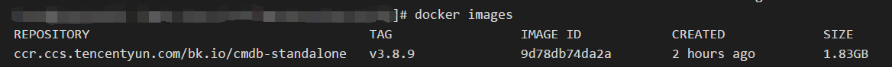

# 极速体验
为了能让大家最快的体验蓝鲸bk-cmdb，社区推出了bk-cmdb的容器部署方式，秒级体验蓝鲸配置平台服务。

## Docker环境

蓝鲸配置平台的容器化部署同时支持让你在Windows, macOS, Linux环境下进行部署。如果你已经
有docker的环境，可以直接进入部署环节。如果你没有docker环境，也想体验，请参照下面的官方链接进行部署。

* windows
  
    docker官方社区目前只支持Windows10(64位)版本，并启用了Hyper-V服务。Docker for Windows的安装
    包在[这里](https://download.docker.com/win/stable/19507/Docker%20for%20Windows%20Installer.exe)
    下载并安装。安装细节可以参考[这里](https://docs.docker.com/docker-for-windows/install/#what-to-know-before-you-install)。

* macOS

    安装命令如下。安装完成后，直接启动docker即可。
    ```shell
    brew cask install docker
    ```
    
 * linux 
    由于linux的发行版本比较多，这里就不逐一列出，大家可以参考docker官方的文档进行安装。
    - [CentOS](https://docs.docker.com/install/linux/docker-ce/centos/)
    - [Debian](https://docs.docker.com/install/linux/docker-ce/debian/)
    - [Fedora](https://docs.docker.com/install/linux/docker-ce/fedora/)
    - [Ubuntu](https://docs.docker.com/install/linux/docker-ce/ubuntu/)

## 部署

* 拉取镜像

    当你有了docker的环境后，就可以在**终端**拉取bk-cmdb的体验镜像了。

    bk-cmdb用于体验的镜像存储于腾讯云的镜像公共镜像仓库。仓库地址在[这里](https://console.cloud.tencent.com/tke/registry/qcloud/default/detail/tag?rid=1&reponame=bk.io%252Fcmdb-standalone)
    。大家可以在这里看到社区对外release的蓝鲸bk-cmdb版本。

    镜像tag(版本)的命名和bk-cmdb的release版本号一致，如v3.1.0。此外，为了方便大家体验最新版本，在镜像
    仓库里会有一个tag为**latest**的镜像，代表目前最新的release版本。所以latest镜像本身是会随着社区release
    的变化而变化。而以版本号(如v3.1.0)为tag的镜像即为指定的版本镜像。

    镜像名称：ccr.ccs.tencentyun.com/bk.io/cmdb-standalone

    镜像tag: latest, v3.1.0等

    拉取镜像时将镜像名称和镜像tag用":"连接起来即可。

    拉取命令：
    ```shell
    docker pull ccr.ccs.tencentyun.com/bk.io/cmdb-standalone:latest
    ```
    执行完成后，就将bk-cmdb的cmdb-standalone:latest镜像下载到了本地。

    执行命令`docker images`，即可看到下载下来的镜像。

    

* 启动容器

    执行如下命令，bk-cmdb容器服务即可启动。其中端口8081可以根据自已环境的实际情况进行调整，不局限于8081。
    ```shell
    docker run -d -p 8081:8090 ccr.ccs.tencentyun.com/bk.io/cmdb-standalone:latest
    ```
    此时你可以打开浏览器，访问`http://127.0.0.1:8081`即可体验最新版的蓝鲸配置平台服务。

    **恭喜你，你正在体验最新的蓝鲸配置平台服务。**
