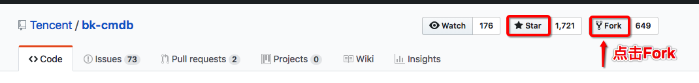
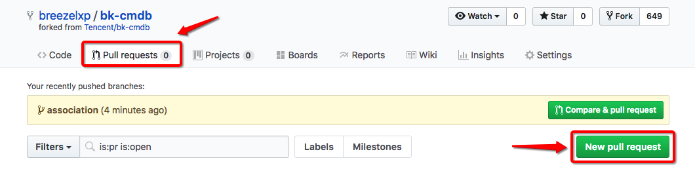
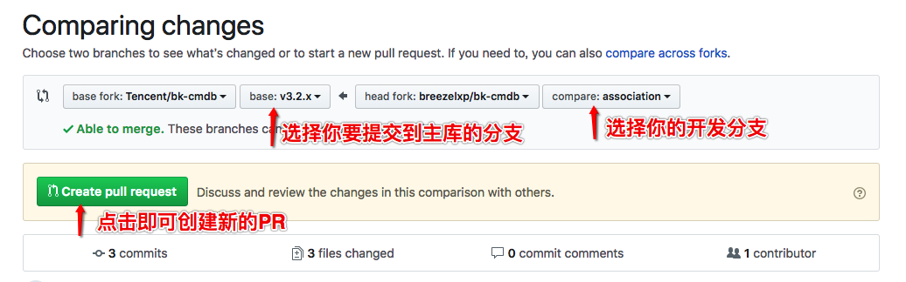
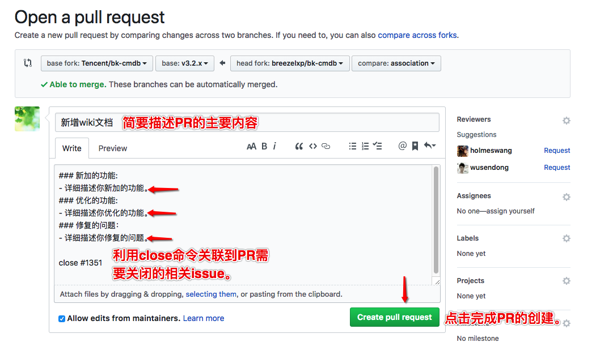
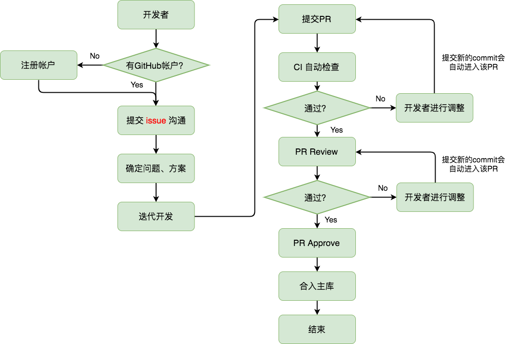

# 社区贡献
蓝鲸cmdb社区欢迎和鼓励大家参与到源代码的维护当中，共同构建良好的社区发展生态。

蓝鲸cmdb社区遵循通用的GitHub代码贡献流程。通过[**issue**](https://github.com/Tencent/bk-cmdb/issues)
与社区成员沟通问题、需求，通过 [**Pull Requests**](https://github.com/Tencent/bk-cmdb/pulls) 参与社区的
代码维护，成为我们的**Contributor**!

社区中的源代码、说明文档、方案设计文档等都是社区宝贵的资源，各位开发者都可以对这些资源进行维护。那么如何参与到社区
资源的维护呢？

## 注册账户
首先，你需要有一个GitHub账户。如果你还没有，没关系，可以到[这里](https://github.com/join)快速的注册一个账户。

## 沟通
接下来，对于bug、需求类的问题，你可以在这里[提交issue](https://github.com/Tencent/bk-cmdb/issues/new)，
反馈你的问题或需求等，和社区做个初步的沟通，目的是为了了解社区是否已经解决了这个问题，或需求已经进入了排期等。
避免由于信息不对称导致你做重复性的工作。

## 确定方案
你提交的问题、需求issue经过了社区的确认，就可以确定相应的解决方案，输出相应的设计文档，接口文档等，这是社区参与
者参与到开发过程的基础。有了这个基础，如果你想继续深度的参与到社区的开发过程中，就可以进入下一个环节中。

## 开发
前文你已经注册了GitHub账户，可以在bk-cmdb的[主页](https://github.com/Tencent/bk-cmdb)将仓库中的源代码
**Fork**到你自己的仓库中，也欢迎你给我们star以示鼓励。如下图：

Fork完成后，就可以在你自己的仓库中看到bk-cmdb的代码。在确定方案后，社区会确定该问题、需求所属的分支、或者tag。
在你将自己的仓库代码**clone**到本地后，需要将代码**checkout**到对应的分支、tag。然后再根据确定的方案、接口
文档等进行对应的开发工作。在开发的过程中可以根据需要将大的需求拆解，分多个**commit**分批提交。

## 提交PR
当完成代码开发后，就可以在你自己的仓库上向bk-cmdb主库发起一个**Pull Request**，将你完成的代码合入到主库中。
在提交PR时要选择好你要合入的对应分支。具体如下：

* 发起PR

    在你的仓库中，进入**Pull requests**页面，点击**New pull request**即可发起创建PR的操作。

* 创建PR

    选择你本地的分支和要提交到主库的分支(确定方案后拿到对应的开发分支)。

* 完成PR创建

    为了方便社区对你的PR进行review，需要你在在PR中填写相应的信息，具体包含的内容如下：

在PR的标题中需要你简要的填写该PR主要的内容。具体的详细信息请在下面的描述框中填写，可以分别是新加、优化功能，或者
是问题修复。最后利用close命令关闭该PR被合入主库后需要关闭的issue。

完成了这些信息的填写，点击**Create pull request**按钮即完成了PR的整个创建流程。

PR创建完成后，社区即收到你的PR，进入PR的review环节。

## PR Review
在你完成PR的提交后，会自动触发CI流程，对提供的代码进行代码扫描、编译检查、单元测试、集成测试等。在通过这些检查后
社区会对你的PR发起**review**。

如果你的PR很完善，符合对应的方案，满足社区对应的开发规范等。恭喜你，社区的reviewer会**Approve**你的PR，然后
将你的PR合入主库。

如果你的PR还需要调整，reviewer会在你的PR下面评论，提出相应的调整建议。待你修改完成后，提交对应的commit，
reviewer会再次发起review，直到你的PR符合要求。最终将你的PR合入主库。

## PR Approve
如果到流程走到了这里，恭喜你，你的PR已经被核准，合入到了主库中。

感谢你为蓝鲸cmdb社区所做出的付出！！！

## 整体流程
为了更直观的展示你参与社区的具体过程，请参阅下图：

整个流程看上去比较复杂，实际操作起来还是比较简单的。希望你不要被这些流程所烦恼。

