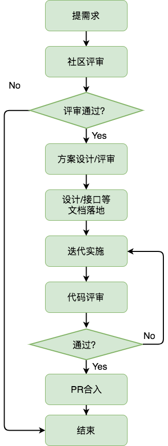

# 提需求
如果你在使用蓝鲸cmdb的过程中发现目前的版本还无法满足你的某些需求，欢迎[创建issue](https://github.com/Tencent/bk-cmdb/issues/new)
将你的需求反馈给我们。社区希望你的需求能够：
- 具有普适的使用场景。
- 在cmdb产品形态的适用范围内。

对于简单的需求，你可以在issue里描述清楚即可。

当然，如果你的需求比较复杂，那么你在提需求的同时，如果能给出需求落地的实施方案那就更好了。具体可以包含，但不局限于以下内容：
* 需求产生的背景；
* 实现这个特性的设计方案；
* 需要调整的组件有那些；
* 代码实现方案；

社区在收到你的需求以后，会在社区范围内对你的需求、方案进行评审。具体的流程如下：

