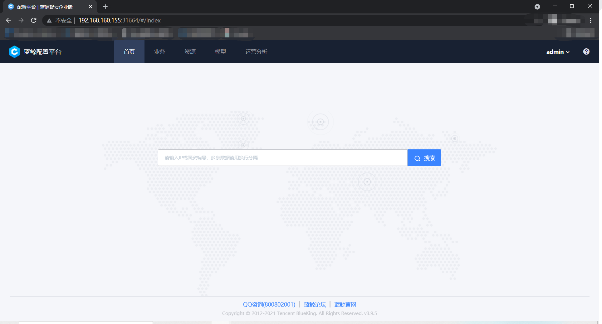

# 通过Helm部署CMDB

## 要求
- [helm3](https://helm.sh/docs/intro/install/)
- [Kubernetes](https://kubernetes.io/docs/setup/), 可以本地测试可以用[minikube](https://kubernetes.io/docs/tasks/tools/install-minikube/)
    

## 准备 bk-cmdb 镜像
- 方式一：使用docker build构建镜像, 详情请参考[制作docker镜像](./build-image.md)
- 方式二：从docker hub下载 `docker pull hoffermei/bk-cmdb:v3.6.3`

## 部署CMDB
```bash
(bk-cmdb) ➜  configcenter git:(v3.6.x) ✗ cd helm/bk-cmdb
(bk-cmdb) ➜  configcenter git:(v3.6.x) ✗ helm install bk-cmdb ./
```

## 检查服务是否正常启动

```bash
(bk-cmdb) ➜  bk-cmdb git:(v3.6.x) ✗ kubectl get pods
NAME                                              READY   STATUS      RESTARTS   AGE
bk-cmdb-bk-cmdb-adminserver-5f489d7dd4-ncll5      1/1     Running     0          104s
bk-cmdb-bk-cmdb-apiserver-7c97d65749-bl2zx        1/1     Running     0          104s
bk-cmdb-bk-cmdb-bootstrap-hnlzn                   0/1     Completed   3          104s
bk-cmdb-bk-cmdb-coreservice-5766d5fdf7-c667z      1/1     Running     0          104s
bk-cmdb-bk-cmdb-datacollection-67dd95b6f9-f2vg7   1/1     Running     0          104s
bk-cmdb-bk-cmdb-eventserver-5d5dff577c-fp6j2      1/1     Running     0          103s
bk-cmdb-bk-cmdb-hostserver-6fb6888686-ffcrx       1/1     Running     1          104s
bk-cmdb-bk-cmdb-operationserver-7f7d4d4cd-5kg7x   1/1     Running     0          104s
bk-cmdb-bk-cmdb-procserver-74bb69f6d7-rjh8m       1/1     Running     0          104s
bk-cmdb-bk-cmdb-taskserver-6985477d56-cmdc6       1/1     Running     0          104s
bk-cmdb-bk-cmdb-tmserver-56dff9bf87-tsl2c         1/1     Running     0          103s
bk-cmdb-bk-cmdb-toposerver-545fd77759-jgzxk       1/1     Running     0          104s
bk-cmdb-bk-cmdb-webserver-84c688c468-5zz88        1/1     Running     0          104s
bk-cmdb-mongodb-589b69cfdc-4dfz5                  1/1     Running     0          104s
bk-cmdb-redis-master-0                            1/1     Running     0          104s
bk-cmdb-redis-slave-5657766c47-7gcvs              1/1     Running     0          104s
bk-cmdb-zookeeper-0                               1/1     Running     0          104s
```

## 导出服务并访问CMDB

```bash
(bk-cmdb) ➜  bk-cmdb git:(v3.6.x) ✗ kubectl get svc
NAME                              TYPE        CLUSTER-IP      EXTERNAL-IP   PORT(S)                      AGE
bk-cmdb-bk-cmdb-adminserver       ClusterIP   10.96.28.239    <none>        80/TCP                       5m41s
bk-cmdb-bk-cmdb-apiserver         ClusterIP   10.96.114.56    <none>        80/TCP                       5m41s
bk-cmdb-bk-cmdb-coreservice       ClusterIP   10.96.162.86    <none>        80/TCP                       5m41s
bk-cmdb-bk-cmdb-datacollection    ClusterIP   10.96.87.252    <none>        80/TCP                       5m41s
bk-cmdb-bk-cmdb-eventserver       ClusterIP   10.96.227.207   <none>        80/TCP                       5m41s
bk-cmdb-bk-cmdb-hostserver        ClusterIP   10.96.105.219   <none>        80/TCP                       5m41s
bk-cmdb-bk-cmdb-operationserver   ClusterIP   10.96.35.69     <none>        80/TCP                       5m41s
bk-cmdb-bk-cmdb-procserver        ClusterIP   10.96.23.104    <none>        80/TCP                       5m41s
bk-cmdb-bk-cmdb-taskserver        ClusterIP   10.96.226.115   <none>        80/TCP                       5m41s
bk-cmdb-bk-cmdb-tmserver          ClusterIP   10.96.88.208    <none>        80/TCP                       5m41s
bk-cmdb-bk-cmdb-toposerver        ClusterIP   10.96.189.177   <none>        80/TCP                       5m41s
bk-cmdb-bk-cmdb-webserver         NodePort    10.96.141.251   <none>        80:32033/TCP                 5m41s
bk-cmdb-mongodb                   ClusterIP   10.96.248.238   <none>        27017/TCP                    5m41s
bk-cmdb-redis-master              ClusterIP   10.96.36.166    <none>        6379/TCP                     5m41s
bk-cmdb-redis-slave               ClusterIP   10.96.134.239   <none>        6379/TCP                     5m41s
bk-cmdb-zookeeper                 ClusterIP   10.96.149.164   <none>        2181/TCP                     5m41s
bk-cmdb-zookeeper-headless        ClusterIP   None            <none>        2181/TCP,3888/TCP,2888/TCP   5m41s
kubernetes                        ClusterIP   10.96.0.1       <none>        443/TCP                      13h

(bk-cmdb) ➜  bk-cmdb git:(v3.6.x) ✗ minikube service bk-cmdb-bk-cmdb-webserver
|-----------|---------------------------|-------------|-----------------------------|
| NAMESPACE |           NAME            | TARGET PORT |             URL             |
|-----------|---------------------------|-------------|-----------------------------|
| default   | bk-cmdb-bk-cmdb-webserver |             | http://192.168.99.100:32033 |
|-----------|---------------------------|-------------|-----------------------------|
🎉  Opening service default/bk-cmdb-bk-cmdb-webserver in default browser...
```

## 运行效果

