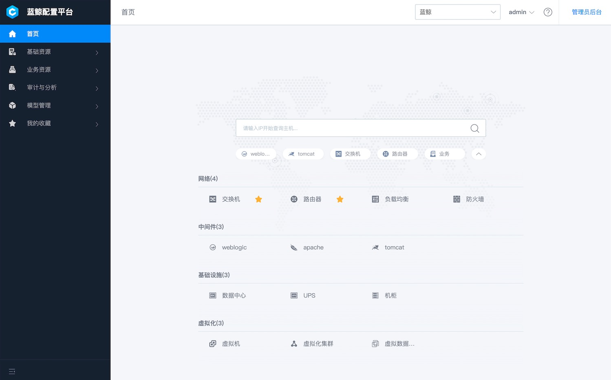

---

[(English Documents Available)](readme_en.md)

> **重要提示**: `master` 分支在开发过程中可能处于 *不稳定或者不可用状态* 。
请通过[releases](https://github.com/tencent/bk-cmdb/releases) 而非 `master` 去获取稳定的二进制文件。

蓝鲸配置平台（蓝鲸CMDB）是一个面向资产及应用的企业级配置管理平台。

蓝鲸配置平台提供了全新自定义模型管理，用户不仅可以方便地实现内置模型属性的拓展，同时也能够根据不同的企业需求随时新增模型和关联关系，把网络、中间件、虚拟资源等纳入到CMDB的管理中。除此之外还增加了更多符合场景需要的新功能：机器数据快照、数据自动发现、变更事件主动推送、更加精细的权限管理、可拓展的业务拓扑等功能。

在技术构建上，架构的核心聚焦于资源，我们把CMDB管理的原子资源分为主机、进程和通用对象三种类型，并构建了对这些资源的原子操作层。在这些原子操作之上，我们构建了更贴近用户操作的场景层，场景层通过对不同资源的组合操作来完成用户的请求。

## Overview
* [设计理念](docs/overview/design.md)
* [架构设计](docs/overview/architecture.md)
* [代码目录](docs/overview/code_framework.md)

## Features
* 拓扑化的主机管理：主机基础属性、主机快照数据、主机归属关系管理
* 组织架构管理：可扩展的基于业务的组织架构管理
* 模型管理：既能管理业务、集群、主机等内置模型，也能自定义模型
* 进程管理：基于模块的主机进程管理
* 事件注册与推送：提供基于回调方式的事件注册与推送
* 通用权限管理：灵活的基于用户组的权限管理
* 操作审计：用户操作行为的审计与回溯

如果想了解以上功能的详细说明，请参考[功能说明](http://bk.tencent.com/document/bkprod/000120.html)

## Experience
* [在线体验蓝鲸CMDB](https://cmdb.bk.tencent.com/login) 🔥
* [极速体验容器化部署蓝鲸CMDB](docs/wiki/container-support.md)

## Getting started
* [下载与编译](docs/overview/source_compile.md)
* [安装部署](docs/overview/installation.md)
* [版本升级说明](docs/wiki/db_upgrade.md)
* [API使用说明见这里](docs/apidoc/)
* [使用CMDB开源版替换社区版](docs/overview/upgrade-from-ce.md)
* [使用Helm部署CMDB到K8S环境](helm/README.md)

## Roadmap
* [版本规划](docs/VERSION.md)
* [版本日志](version.md)

## Support
- [wiki](https://github.com/Tencent/bk-cmdb/wiki)
- [白皮书](https://docs.bk.tencent.com/cmdb/)
- [蓝鲸论坛](https://bk.tencent.com/s-mart/community)
- [蓝鲸 DevOps 在线视频教程](https://cloud.tencent.com/developer/edu/major-100008)
- [蓝鲸社区版交流1群](https://jq.qq.com/?_wv=1027&k=5zk8F7G)
- 技术交流QQ群(305496802), 扫码入群戳[这里](docs/resource/img/qq.png)

## BlueKing Community
- [BK-CI](https://github.com/Tencent/bk-ci)：蓝鲸持续集成平台是一个开源的持续集成和持续交付系统，可以轻松将你的研发流程呈现到你面前。
- [BK-BCS](https://github.com/Tencent/bk-bcs)：蓝鲸容器管理平台是以容器技术为基础，为微服务业务提供编排管理的基础服务平台。
- [BK-BCS-SaaS](https://github.com/Tencent/bk-bcs-saas)：蓝鲸容器管理平台SaaS基于原生Kubernetes和Mesos自研的两种模式，提供给用户高度可扩展、灵活易用的容器产品服务。
- [BK-PaaS](https://github.com/Tencent/bk-PaaS)：蓝鲸PaaS平台是一个开放式的开发平台，让开发者可以方便快捷地创建、开发、部署和管理SaaS应用。
- [BK-SOPS](https://github.com/Tencent/bk-sops)：标准运维（SOPS）是通过可视化的图形界面进行任务流程编排和执行的系统，是蓝鲸体系中一款轻量级的调度编排类SaaS产品。

## Contributing
如果你有好的意见或建议，欢迎给我们提 Issues 或 Pull Requests，为蓝鲸开源社区贡献力量。关于bk-cmdb分支管理、Issue 以及 PR 规范，
请阅读 [Contributing Guide](docs/CONTRIBUTING.md)。

[腾讯开源激励计划](https://opensource.tencent.com/contribution) 鼓励开发者的参与和贡献，期待你的加入。

## Partners

　　　　

## License
项目基于 MIT 协议， 详细请参考 [LICENSE](LICENSE.txt) 。
