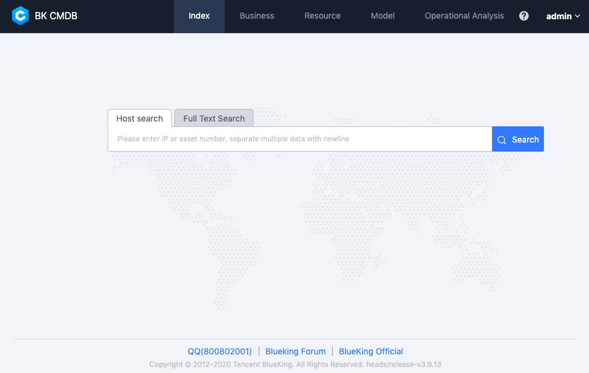

---

> **Note**: The `master` branch may be in an *unstable or even broken state* during development.
Please use [releases](https://github.com/tencent/bk-cmdb/releases) instead of the `master` branch in order to get stable binaries.

BlueKing Configuration Management DataBase (bk-cmdb) is an enterprise level configuration management serivce database. 

bk-cmdb provide user complete new way of self define model management. Users can not only can easily expand the built-in model attributes, but also can add models and associations at any time according to different enterprise requirements, and incorporate networks, middleware, and virtual resources into the bk-cmdb. It also adds more new features that meet the needs of the certain requirement. For example: machine data snapshots, automatic data discovery, active push of change events, more granular rights management, and expandable service topology, etc. 

The core of the new version focuses on resources. We divide the atomic resources managed by CMDB into host, process, and generic objects, and build an atomic operation layer on these resources. On top of these atomic operations, we built a scenario layer that is closer to the user's operations. The scenario layer completes the user's request through a combination of different resources.

The open source version will be in both BlueKing Community Edition and Enterprise Edition and be updated simultaneously. Our goal is to create a unified configuration management platform that can be compatible with different industries and different architectures, and to become the industry's leading free and open source CMDB with good versatility and ease of use. We welcome colleagues who are interested in participating in it.

## Overview
* [Design philosophy (In Chinese)](docs/overview/design.md)
* [Architecture Design (In Chinese)](docs/overview/architecture.md)
* [code directory (In Chinese)](docs/overview/code_framework.md)

## Features
* Topological host management: host basic attributes, host snapshot data, host ownership management
* Organizational Structure Management: Scalable Business-Based Organizational Structure Management
* Model management: Manage business, cluster, host and other built-in models, and customizable model management.
* Process Management: Module-based host process management
* Event registration and push: provide callback-based event registration and push
* Universal Rights Management: Flexible User Group Based Rights Management
* Operation Audit: Auditing and Backtracking of User Operational Behavior

If you want to know more about the above features, please refer to the [Function Description (In Chinese)](http://bk.tencent.com/document/bkprod/000120.html)

## Getting started
* [Download and Compile (In Chinese)](docs/overview/source_compile.md)
* [Installation and Deployment (In Chinese)](docs/overview/installation.md)
* API Instructions (In Chinese), [docs](docs/apidoc)
* [Replace Community Version with This Version](docs/overview/upgrade-from-ce.md)

## Roadmap
* [Version iteration rules (In Chinese)](docs/VERSION.md)
* [Changelog](version.md)

## Support
- [Wiki (In Chinese)](https://github.com/Tencent/bk-cmdb/wiki) or ask for help
- [White paper(In Chinese)](https://docs.bk.tencent.com/cmdb/)
- [BK forum](https://bk.tencent.com/s-mart/community)
- [BK DevOps online video tutorial(In Chinese)](https://cloud.tencent.com/developer/edu/major-100008)
- Contact us, technical exchange QQ group：305496802

## BlueKing Community
- [BK-CI](https://github.com/Tencent/bk-ci)：a continuous integration and continuous
 delivery system that can easily present your R & D process to you.
- [BK-BCS](https://github.com/Tencent/bk-bcs)：a basic container service platform which provides
 orchestration and management for micro-service business.
- [BK-BCS-SaaS](https://github.com/Tencent/bk-bcs-saas)：a SaaS provides users with highly scalable
, flexible and easy-to-use container products and services.
- [BK-PaaS](https://github.com/Tencent/bk-PaaS)：an development platform that allows developers to create, develop, deploy and manage SaaS applications easily and quickly.
- [BK-SOPS](https://github.com/Tencent/bk-sops)：an lightweight scheduling SaaS  for task flow
 scheduling and execution through a visual graphical interface. 

## Contributing
If you have good ideas or suggestions, please let us know by Issues or Pull Requests and contribute to the Blue Whale
 Open Source Community. For CMDB branch management, issues, and pr specifications, read the
 [Contributing Guide](docs/CONTRIBUTING.md)。

If you are interested in contributing, check out the [CONTRIBUTING.md], also join our
 [Tencent OpenSource Plan](https://opensource.tencent.com/contribution).

## Partners

　　　　

## License
Bk-cmdb is based on the MIT protocol. Please refer to [LICENSE](LICENSE) for details.
