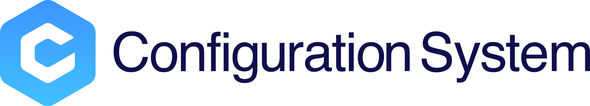

---

> **Note**: The `master` branch may be in an *unstable or even broken state* during development.
Please use [releases](https://github.com/tencent/bk-cmdb/releases) instead of the `master` branch in order to get stable binaries.

BlueKing Configuration Management DataBase (bk-cmdb) is an enterprise level configuration management serivce database. 

The version 3.0 is a complete new change compare to version 2.0. It provide user complete new way of self define model management. Users can not only can easily expand the built-in model attributes, but also can add models and associations at any time according to different enterprise requirements, and incorporate networks, middleware, and virtual resources into the bk-cmdb. It also adds more new features that meet the needs of the certain requirement. For example: machine data snapshots, automatic data discovery, active push of change events, more granular rights management, and expandable service topology, etc. 

The core of the new version focuses on resources. We divide the atomic resources managed by CMDB into host, process, and generic objects, and build an atomic operation layer on these resources. On top of these atomic operations, we built a scenario layer that is closer to the user's operations. The scenario layer completes the user's request through a combination of different resources.

Version 3.0 uses golang as a development language. Compared to version 2.0, the operating efficiency of the system is greatly improved. In addition, the microservice architecture design is adopted, so deployment can support the traditional mode and the container mode.

The open source version will be in both BlueKing Community Edition and Enterprise Edition and be updated simultaneously. Our goal is to create a unified configuration management platform that can be compatible with different industries and different architectures, and to become the industry's leading free and open source CMDB with good versatility and ease of use. We welcome colleagues who are interested in participating in it.

## Overview
* [Architecture Design (In Chinese)](docs/overview/architecture.md)
* [code directory (In Chinese)](docs/overview/code_framework.md)
* [Design philosophy (In Chinese)](docs/overview/design.md)
* [Use Scenario (In Chinese)](docs/overview/usecase.md)

## Features
* Topological host management: host basic attributes, host snapshot data, host ownership management
* Organizational Structure Management: Scalable Business-Based Organizational Structure Management
* Model management: Manage business, cluster, host and other built-in models, and customizable model management.
* Process Management: Module-based host process management
* Event registration and push: provide callback-based event registration and push
* Universal Rights Management: Flexible User Group Based Rights Management
* Operation Audit: Auditing and Backtracking of User Operational Behavior

If you want to know more about the above features, please refer to the [Function Description (In Chinese)](http://bk.tencent.com/document/bkprod/000120.html)

## Getting started
* [Download and Compile (In Chinese)](docs/overview/source_compile.md)
* [Installation and Deployment (In Chinese)](docs/overview/installation.md)
* [API Instructions (In Chinese)](docs/apidoc/readme.md)

## Version plan
* [Version iteration rules (In Chinese)](docs/VERSION.md)

## Support
1. Refer to the bk-cmdb installation document [Installation Documentation (In Chinese)](docs/overview/installation.md)
2. Read [source (In Chinese)](https://github.com/Tencent/bk-cmdb/tree/master)
3. Read the wiki (In Chinese)(https://github.com/Tencent/bk-cmdb/wiki/cmdb-3.0) or ask for help
4. Learn about BlueKing Community related information: [Blue Whale Community Edition 1 Group](https://jq.qq.com/?_wv=1027&k=5zk8F7G)
5. Contact us, technical exchange QQ group:

## Contributing
For bk-cmdb branch management, issues, and pr specifications, read the [bk-cmdb Contributing Guide (In Chinese)](docs/CONTRIBUTING.md).

## FAQ

https://github.com/Tencent/bk-cmdb/wiki/FAQ

## License
Bk-cmdb is based on the MIT protocol. Please refer to [LICENSE](LICENSE) for details.
