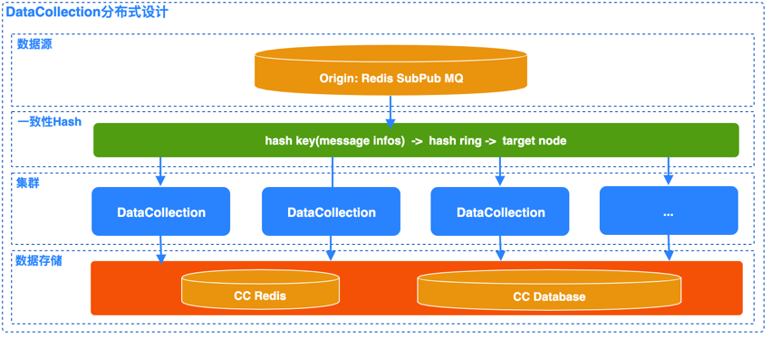
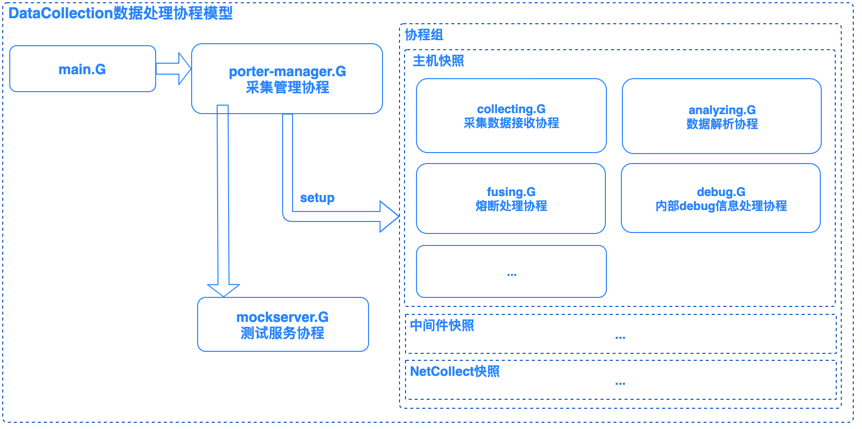

## DataCollection
> 采集数据处理模块

## 支持的采集类型

* `hostsnap`  用于采集/更新主机信息
* `middleware` 可以录入模型/模型属性/实例
* `netcollect` 用于录入/更新数据到 `cc_NetcollectReport` collection

## 模块设计



* `数据源(Origin)`: 采集的数据节点采集器会将数据发送到指定的外部Redis队列, DataCollection订阅指定Topics接收采集数据;
* `数据分片(Sharding)`: 基于Redis队列特性，订阅相同Topics的消费节点(DataCollection)均会受到同一个消息，故此在分布式模式下基于一致性Hash进行数据分片;
* `集群(Cluster)`：DataCollection集群，节点之间基于Hash规则分割数据，节点基于ZK做服务发现，动态更新HashRing，即集群支持动态扩缩容;
* `数据存储`: 数据经由DataCollection处理后统一存储到CC Redis或CC Database;

## 协程模型



* `porter-manager.G(采集管理协程)`: 采集数据处理porter管理协程，负责新Porter的Setup操作, 并可选的开启Mock服务；
* `mockserver.G(测试服务协程)`: 处理测试数据，将数据塞入对应的Porter进行数据分析和处理;
* `collecting.G(采集数据接收协程)`: 接收指定的采集数据并分发到执行的Message Channel供解析器处理;
* `analyzing.G(数据解析协程)`: 数据解析器，负责数据解析处理；
* `fusing.G(熔断处理协程)`: 负责执行类型采集数据队列的熔断，淘汰未能及时处理的淤积数据；
* `debug.G(内部debug信息处理协程)`: 处理内部的debug信息;

## 注意事项

* 实例录入必须有 `bk_inst_key` 字段, 否则实例无法录入

## 测试
> `DataCollection` 模块提供`MockServer`服务用于测试。
> 实现原理是启动一个HTTP服务(默认绑定地址localhost:12140)，收到请求后将消息放入对应消息类型的Porter处理队列中。

- 编译参数配置: `go build -i -ldflags "-X configcenter/src/common/version.CCRunMode=dev"`

- mock数据发生:

```python
# -*- coding: utf8 -*-
import json

import requests

msg = {
    ... # your mock message.
}

data = {
    "name": "hostsnap",
    "mesg": json.dumps(msg)
}

url = "http://127.0.0.1:12140"

response = requests.request("POST", url, data=json.dumps(data))

print(response.status_code, response.text)
```
