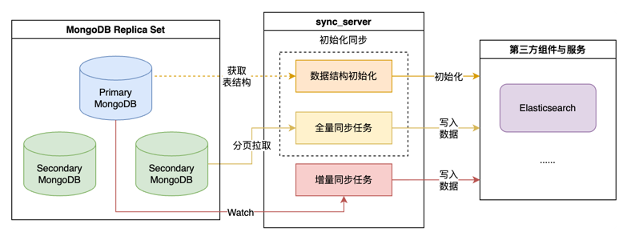

sync server
===========

## 概述

sync server 负责和第三方组件与服务进行数据同步。支持数据结构和元数据初始化，和全量数据同步和增量数据同步的后台任务，并提供[数据同步小工具](../../tools/cmdb_ctl/readme.md#数据同步)对数据进行补偿同步。简要的同步方式如下：



## 全文检索同步

将MongoDB中的数据同步到Elasticsearch中，通过Watch机制进行增量同步。第一次部署时会进行初始化操作将所有需要进行全文检索的数据全量同步到ES。

### 索引管理

cmdb将会创建附带特定版本后缀的真实ES索引，如`bk_cmdb.biz_20210701`, 并且只会在索引不存在时创建，特定版本索引的结构信息在代码中固定，在索引结构发生变化时代码中的版本后缀也会发生变化。
在成功创建索引后，cmdb会为每一个索引创建系统别名，如`bk_cmdb.biz` `bk_cmdb.set` `bk_cmdb.module` `bk_cmdb.host` `bk_cmdb.model` `bk_cmdb.object_instance`, 这些别名为蓝鲸CMDB内部索引、查询等操作所使用的别名。

索引版本发生变化时cmdb会进行索引迁移，将旧索引替换为新索引，并将旧索引中的数据迁移到新索引中。该操作耗时较长，迁移时全文检索数据可能不准确。

阅读官方文档 [elastic reindex doc](https://www.elastic.co/guide/en/elasticsearch/reference/current/docs-reindex.html) 了解reindex操作。
阅读官方文档 [elastic alias doc](https://www.elastic.co/guide/en/elasticsearch/reference/current/indices-aliases.html) 了解索引别名机制。

### 配置

通过common.yaml配置文件里的syncServer配置管理同步所需的配置，mongo和es等通用组件的配置使用mongodb.yaml和common.yaml中的通用配置，全文检索的同步配置在其中的fullTextSearch配置项中：

``` yaml
# syncServer相关配置
syncServer:
  # 全文检索同步相关配置
  fullTextSearch:
    # 是否开启全文检索同步, 默认为false
    enableSync: true
	# ES索引拥有的主分片数量，详情请参见：https://www.elastic.co/guide/en/elasticsearch/reference/current/index-modules.html
	indexShardNum: 1
	# ES索引每个主分片拥有的副本数量，详情请参见：https://www.elastic.co/guide/en/elasticsearch/reference/current/index-modules.html
	indexReplicaNum: 1
```
