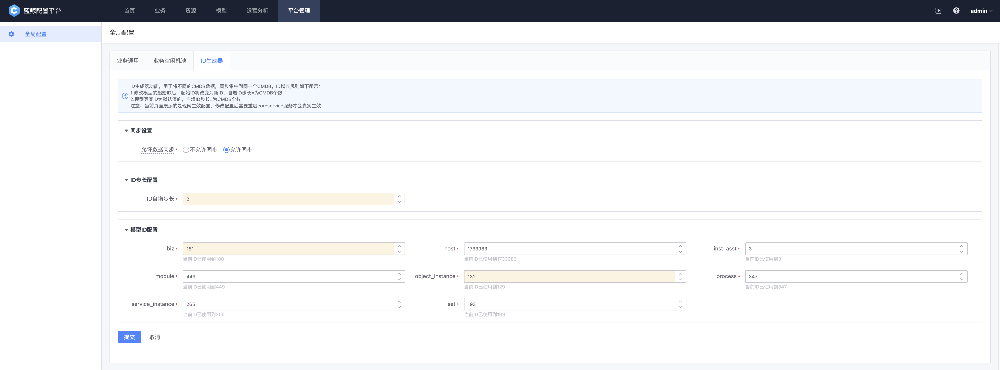

## CMDB同步服务简介

### 概述
CMDB同步服务用于将一个环境(源环境)的CMDB数据同步到另一个环境(目标环境)的CMDB中。支持同步的资源类型：biz(业务), set(集群), module(模块), host(主机), host_relation(主机关系), object_instance(模型实例), inst_asst(实例关联), service_instance(服务实例), process(进程), process_relation(进程关系), quoted_instance(表格字段实例)

#### 同步流程
1. 源环境的CMDB同步服务支持通过定时或调用接口的方式拉取数据，将需要同步的数据全量同步到目标环境，并支持将变更的数据增量同步到目标环境
2. 源环境的CMDB同步服务将需要同步的增量数据按约定的接口协议传输给传输介质
3. 源环境的传输介质将数据传输到目标环境
4. 目标环境中的CMDB同步服务按约定的协议从传输介质中读取数据
5. 目标环境的CMDB同步服务将数据写入到目标环境中


#### ID生成规则
需要通过配置ID生成器的起始ID和步长保证每个参与同步的环境的ID均不可以重复。配置方式：
1. 清理所有环境中ID冲突的存量数据
2. 确认一共有多少环境需要参与同步，包括源和目标环境，将所有环境的ID生成器的步长配置为一个大于等于环境数的数值。更新后生成的每个ID的值均为上一个ID的值加上步长
3. 按步长的倍数加上不同的余数配置每个环境的资源起始ID，每种资源的起始ID需要大于所有环境中当前这种资源最大的ID，保证所有环境新生成的ID均不会重复
4. 在目标环境中配置所有源环境的每种资源的ID生成器的步长和对应的生效区间，用于根据ID判断数据属于哪个环境

示例：


### 服务配置
在common.yaml里增加以下配置项：
```
# CMDB同步服务配置
transferService:
  # 是否开启同步, 默认为false
  enableSync: true
  # 是否开启增量同步, 默认为false
  enableIncrSync: true
  # 同步服务的名称
  name: env1
  # 同步角色，src表示源环境(将数据同步到目标环境)，dest表示目标环境(接收源环境的同步数据)
  role: src
  # 全量同步周期，单位：小时，仅源环境需要配置
  syncIntervalHours: 24
  # 传输介质地址
  transferMediumAddress:
  - 127.0.0.1
```

启动参数：
```
源环境：
./cmdb_transferservice --addrport=${服务监听地址} --regdiscv=${zk地址} --logtostderr=${是否把日志输出到stderr} --log-dir=${日志存放路径} --v=${日志级别}

目标环境：
./cmdb_transferservice --sync-config=${CMDB同步服务额外配置} --addrport=${服务监听地址} --regdiscv=${zk地址} --logtostderr=${是否把日志输出到stderr} --log-dir=${日志存放路径} --v=${日志级别}
```

目标环境的sync-config启动参数指定的CMDB同步服务额外配置文件示例，其中主机资源的ID生成规则配置与上述ID生成规则示例一致：
``` 
# 所有源环境的ID生成规则配置，用于判断同步的资源ID属于哪个环境
idRules:
  - # 源环境同步服务的名称
    name: srcEnv1
    # 源环境使用过的所有ID生成规则列表，按资源类型配置对应的ID生成器生效的区间和步长
    rules:
      - # 资源类型，此处示例为主机
        resource: host
        # 源环境中该资源类型对应的ID生成规则列表，源环境配置了多次ID生成规则的情况下需要将所有的ID生成规则均配置到目标环境的配置文件中
        rules:
          - # ID生成器生效的区间起始ID
            startID: 1
            # ID生成器生效的区间终点ID
            endID: 31
            # ID生成器步长
            step: 3
          - # ID生成器生效的区间起始ID
            startID: 305
            # ID生成器生效的区间终点ID，-1表示无穷大
            endID: -1
            # ID生成器步长
            step: 4
      - # 资源类型，此处示例为业务
        resource: biz
        # 源环境中该资源类型对应的ID生成规则列表，源环境配置了多次ID生成规则的情况下需要将所有的ID生成规则均配置到目标环境的配置文件中
        rules:
          - # ID生成器生效的区间起始ID
            startID: 1
            # ID生成器生效的区间终点ID
            endID: 40
            # ID生成器步长
            step: 3
          - # ID生成器生效的区间起始ID
            startID: 41
            # ID生成器生效的区间终点ID，-1表示无穷大
            endID: -1
            # ID生成器步长
            step: 4
  - # 源环境同步服务的名称
    name: srcEnv2
    # 源环境使用过的所有ID生成规则列表，按资源类型配置对应的ID生成器生效的区间和步长
    rules:
      - # 资源类型，此处示例为主机
        resource: host
        # 源环境中该资源类型对应的ID生成规则列表，源环境配置了多次ID生成规则的情况下需要将所有的ID生成规则均配置到目标环境的配置文件中
        rules:
          - # ID生成器生效的区间起始ID
            startID: 2
            # ID生成器生效的区间终点ID
            endID: 302
            # ID生成器步长
            step: 3
          - # ID生成器生效的区间起始ID
            startID: 306
            # ID生成器生效的区间终点ID，-1表示无穷大
            endID: -1
            # ID生成器步长
            step: 4
      - # 资源类型，此处示例为业务
        resource: biz
        # 源环境中该资源类型对应的ID生成规则列表，源环境配置了多次ID生成规则的情况下需要将所有的ID生成规则均配置到目标环境的配置文件中
        rules:
          - # ID生成器生效的区间起始ID
            startID: 2
            # ID生成器生效的区间终点ID
            endID: 8
            # ID生成器步长
            step: 3
          - # ID生成器生效的区间起始ID
            startID: 42
            # ID生成器生效的区间终点ID，-1表示无穷大
            endID: -1
            # ID生成器步长
            step: 4
  - # 源环境同步服务的名称
    name: srcEnv3
    # 源环境使用过的所有ID生成规则列表，按资源类型配置对应的ID生成器生效的区间和步长
    rules:
      - # 资源类型，此处示例为主机
        resource: host
        # 源环境中该资源类型对应的ID生成规则列表，源环境配置了多次ID生成规则的情况下需要将所有的ID生成规则均配置到目标环境的配置文件中
        rules:
          - # ID生成器生效的区间起始ID
            startID: 307
            # ID生成器生效的区间终点ID，-1表示无穷大
            endID: -1
            # ID生成器步长
            step: 4
      - # 资源类型，此处示例为业务
        resource: biz
        # 源环境中该资源类型对应的ID生成规则列表，源环境配置了多次ID生成规则的情况下需要将所有的ID生成规则均配置到目标环境的配置文件中
        rules:
          - # ID生成器生效的区间起始ID
            startID: 43
            # ID生成器生效的区间终点ID，-1表示无穷大
            endID: -1
            # ID生成器步长
            step: 4
# 系统内置数据ID信息，用于将源环境的内置数据ID转换为目标环境的内置数据ID，如果某个环境没有配置的话则不会对内置数据ID进行转换
innerDataID:
  - # 源环境同步服务的名称
    name: srcEnv1
    # 主机池ID信息
    hostPool:
      # 主机池业务ID
      biz: 1
      # 主机池空闲机池集群ID
      set: 1
      # 主机池空闲机模块ID
      module: 1
  - # 源环境同步服务的名称
    name: srcEnv2
    # 主机池ID信息
    hostPool:
      # 主机池业务ID
      biz: 1
      # 主机池空闲机池集群ID
      set: 2
      # 主机池空闲机模块ID
      module: 3
  - # 源环境同步服务的名称
    name: srcEnv3
    # 主机池ID信息
    hostPool:
      # 主机池业务ID
      biz: 2
      # 主机池空闲机池集群ID
      set: 4
      # 主机池空闲机模块ID
      module: 6
```

## CMDB同步操作指引

### 前置准备
需要通过管理手段保证以下几点：
1. 源和目标环境的模型、模型字段、业务自定义字段、唯一校验、模型分组、关联类型、模型关联、自定义层级、管控区域、服务分类等不需要同步的被依赖数据必须保持一致，如果不一致可能导致数据同步失败或产生脏数据
2. 开始同步后不可以新增或删除自定义层级，否则会导致业务拓扑数据同步失败
3. 源和目标环境中的数据必须保证唯一键不重复，如果唯一校验冲突则会导致数据同步失败
4. 源和目标环境的版本需要保持一致，如果不一致则可能导致同步的数据格式不一致
5. 需要保证参与同步的所有环境中除了系统内置数据之外需要同步的资源的ID都不可以重复

### 操作流程

1. 在需要同步的环境上更新ID生成器，保证每个环境的ID均不重复。操作方式参考：[ID生成器更新操作指引](#ID生成器更新操作指引)
2. 在所有需要同步的环境上准备好CMDB同步服务的配置文件。配置方式参考：[服务配置](#服务配置)
3. 开启传输介质，将源环境的数据传输到目标环境。CMDB不提供官方传输介质，如果需要自己开发传输介质，可以按照[传输介质接口协议](#传输介质接口协议)实现同步数据的推送和拉取接口
4. 在需要同步的环境中启动服务进行同步

### 注意事项
- CMDB同步服务保证数据的最终一致性，在同步过程中可能会有部分数据不一致的情况
- 仅支持从一个环境单向同步到另一个环境，不支持双向同步
- 源环境的数据仅以源环境为准，同步时如果目标环境对源环境同步的数据进行了操作则按源环境的数据直接覆盖
- 蓝鲸业务的业务拓扑、主机、服务实例、进程等资源均不同步
- 目标环境的额外同步配置中需要配置所有源环境的ID生成规则和内置数据ID信息，没有配置的源环境数据不会进行同步，且如果配置有误可能会导致同步的数据错误

### ID生成器更新操作指引
#### 前置准备
通过管理手段保证所有环境中没有ID重复的待同步资源的存量数据，不包括系统内置数据和不参与同步的数据，如：主机池业务、蓝鲸业务、默认/未分配云区域等
如果系统中存在这种存量数据，可以首先将需要同步的存量数据导出，然后删除所有存量数据，完成后续ID生成器更新流程后再将需要同步的存量数据重新导入

#### 操作流程
需要在所有参与同步的环境中通过配置ID生成器的起始ID和步长保证每个环境的ID均不重复。配置方式：
1. 停止所有新增数据操作：在coreservice启动命令中增加`--disable-insertion=true`配置项并重启服务，重启服务后新增数据操作会报错。启动命令示例：
```
./cmdb_coreservice --disable-insertion=true --addrport=127.0.0.1:1234 --regdiscv=127.0.0.1:2181 --logtostderr=false --log-dir=./logs --v=3
```
2. 在平台管理页面更新ID生成器配置：
    
    1. 进入到平台管理页面，点击ID生成器tab
    2. 将“允许数据同步”配置项设置为“允许同步”，如果这个配置项为“不允许同步”则不会进行CMDB数据同步
    3. 确认一共有多少环境需要参与同步，包括源和目标环境，将所有环境的“ID自增步长”配置项配置为一个相同的大于等于环境数的数值。更新后生成的每个ID的值均为上一个ID的值加上步长
    4. 按步长的倍数加上不同的余数在“模型ID配置”配置项中每种同步资源的起始ID配置每个环境的起始ID，起始ID需要大于所有环境中当前最大的ID，保证所有环境新生成的ID均不会重复
    5. 点击提交按钮提交ID生成器配置
3. 删除第一步中在coreservice启动命令中增加的`--disable-insertion=true`配置项
4. 依次重启所有服务，在所有服务完成重启之前不要进行任何新增操作

#### 注意事项
- 操作过程中需要停止所有新增操作，防止新增数据的ID不满足更新后的ID生成规则
- 如果多个环境中存在除了内置数据之外的ID重复的存量数据，会导致同步时这种数据同步失败
- 需要保证ID自增步长配置项的值大于或等于参与同步的CMDB环境数量，如果不满足则不同环境生成的ID可能会重复
- 需要保证要更新的起始ID的每种资源配置的起始ID均大于该资源当前的最大ID，如果不满足则ID生成器配置会更新失败
- 需要保证同一种同步资源在每个环境的起始ID除以ID自增步长之后的余数均不相同，如果不满足则不同环境生成的ID可能会重复
- ID生成器配置更新后并不会立即生效，需要重启服务后才会生效，建议更新ID生成器配置后直接重启服务

### 传输介质接口协议

#### 同步资源推送接口

##### 请求方法与URL
POST /api/sync/publish

##### 描述
接收CMDB同步服务推送的资源信息，投递到指定抽象消息队列

##### 输入参数
| 参数名称          | 参数类型   | 必选 | 描述                                                                                                                                  |
|---------------|--------|----|-------------------------------------------------------------------------------------------------------------------------------------|
| resource_type | string | 是  | 同步数据的资源类型，枚举值：biz,set,module,host,host_relation,object_instance,inst_asst,service_instance,process,process_relation,quoted_instance |
| sub_resource  | string | 否  | 下级数据类型。resource为object_instance和inst_asst时代表需要同步的模型的bk_obj_id                                                                       |
| is_increment  | bool   | 否  | 是否为增量同步，默认为true                                                                                                                     |
| data          | any    | 是  | 要同步的资源详情                                                                                                                            |

##### 调用示例
```json
{
   "resource_type": "object_instance",
   "sub_resource": "bk_switch",
   "is_increment": false,
   "data": [
       {
           "bk_inst_id": 1,
           "bk_inst_name": "xxx"
       }
   ]
}
```

##### 响应示例
```json
{
  "result": true,
  "code": 0,
  "message": "",
  "data": null
}
```

##### 响应参数说明
| 参数名称       | 参数类型   | 描述                         |
|------------|--------|----------------------------|
| result     | bool   | 请求成功与否。true:请求成功；false请求失败 |
| code       | int    | 错误编码。 0表示success，>0表示失败错误  |
| message    | string | 请求失败返回的错误信息                |
| data       | object | 请求返回的数据                    |

#### 同步资源拉取接口

##### 请求方法与URL
POST /api/sync/consume

##### 描述
根据资源类型，从抽象消息队列中拉取一条消息

##### 输入参数
| 参数名称          | 参数类型   | 必选 | 描述                                                                                                                                  |
|---------------|--------|----|-------------------------------------------------------------------------------------------------------------------------------------|
| resource_type | string | 是  | 同步数据的资源类型，枚举值：biz,set,module,host,host_relation,object_instance,inst_asst,service_instance,process,process_relation,quoted_instance |
| sub_resource  | string | 否  | 下级数据类型。resource为object_instance和inst_asst时代表需要同步的模型的bk_obj_id                                                                       |
| is_increment  | bool   | 否  | 是否为增量同步，默认为true                                                                                                                     |
| ack           | bool   | 是  | 是否对上次消费的消息进行ack，默认true。如果ack=false，代表消费者未确认消息消费成功，因此接口会返回上次消费的消息数据                                                                  |

##### 调用示例
```json
{
   "resource_type": "object_instance",
   "sub_resource": "bk_switch",
   "is_increment": false,
   "ack": true
}
```

##### 响应示例
```json
{
    "result": true,
    "code": 0,
    "data": {
        "total": 1000,
        "info": {
              "bk_obj_id": "bk_switch",
              "bk_inst_id": 100
        }
    }
}
```

##### 响应参数说明
| 参数名称       | 参数类型   | 描述                         |
|------------|--------|----------------------------|
| result     | bool   | 请求成功与否。true:请求成功；false请求失败 |
| code       | int    | 错误编码。 0表示success，>0表示失败错误  |
| message    | string | 请求失败返回的错误信息                |
| data       | object | 请求返回的数据                    |

##### data
| 参数名称  | 参数类型 | 描述           |
|-------|------|--------------|
| total | int  | 当前队列中剩余的消息总数 |
| info  | any  | 所投递的消息内容     |
