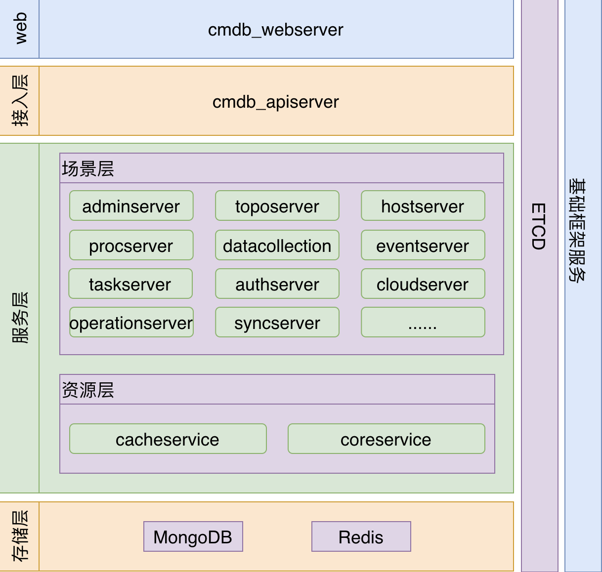

# BK-CMDB

蓝鲸配置平台（蓝鲸CMDB）是一个面向资产及应用的企业级配置管理平台。

本文档内容为如何在 Kubernetes 集群上部署 BK-CMDB 服务。

说明：内置的mongodb、redis、zookeeper、elasticsearch等组件仅用于测试环境，正式环境部署必须配置为外部组件。

## BK-CMDB 部署项目

### 子服务介绍

BK-CMDB由15个服务组成

|      名称       | 描述 |
| :-------------: | :--: |
|    webserver    | Web服务管理，用户登陆管理等 |
|    apiserver    | API网关；负责API路由，用户鉴权等 |
|   adminserver   | 自动升级管理、配置管理、权限视图管理、权限数据同步等 |
|   authserver    | 与权限相关的功能管理，包括：鉴权、有权限资源查询、IAM资源回调 |
|   cloudserver   | 云资源管理：包括云主机同步、云区域管理、云帐户管理等 |
| datacollection  | 主机快照管理、中间件数据采集管理、设备采集管理 |
|   eventserver   | 事件订阅管理、事件生成管理、事件推送管理等 |
| operationserver | 运营统计功能管理：数据统计，图表管理等 |
|   hostserver    | 主机相关服务管理：包括主机CRUD、主机转移、主机属性自动应用、云区域管理、动态分组管理等 |
| procserver | 服务模板管理、进程模板、服务分类管理、服务实例管理、进程实例管理、进程同步管理等 |
| synchronizeserver | 数据同步功能服务 |
| taskserver | 所有异步任务管理，包括执行、状态管理等 |
| toposerver | 业务管理，主线拓扑管理，模型管理、模型实例管理、模型关联关系管理、模型实例关联关系管理 |
| coreservice | 核心原子接口管理服务，直接与Mongodb交互 |
| cacheservice | 缓存服务管理、资源事件流管理。直接与Mongodb/Redis交互 |


### 架构图



## 部署

### 环境要求

- Kubernetes 1.12+
- Helm 3+


### 安装Chart

 使用以下命令安装名称为`bkcmdb`的release, 其中`<bkcmdb helm repo url>`代表helm仓库地址:

```shell
$ helm repo add bkee <bkcmdb helm repo url>
$ helm install bkcmdb bkee/bkcmdb
```

上述命令将使用默认配置在Kubernetes集群中部署bkcmdb, 并输出访问指引。


### 卸载Chart

使用以下命令卸载`bkcmdb`:

```shell
$ helm uninstall bkcmdb
```

上述命令将移除所有和bkrepo相关的Kubernetes组件。


## Chart依赖

- [bitnami/mongodb](https://github.com/bitnami/charts/tree/master/bitnami/mongodb)
- [bitnami/redis](https://github.com/bitnami/charts/tree/master/bitnami/redis)
- [bitnami/zookeeper](https://github.com/bitnami/charts/tree/master/bitnami/zookeeper)
- [bitnami/elasticsearch](https://github.com/bitnami/charts/tree/master/bitnami/elasticsearch)

## 配置说明

各项配置集中在仓库的一个values.yaml文件之中

### 镜像拉取策略

|      参数       |     描述     |    默认值    |
| :-------------: | :----------: | :----------: |
| imagePullPolicy | 镜像拉取策略 | IfNotPresent |

### 镜像地址前缀
|      参数       |     描述     |    默认值    |
| :-------------: | :----------: | :----------: |
| image.registry | 镜像地址前缀 | mirrors.tencent.com/bkce |

### 启动时初始化数据库配置说明

启动时会执行一个job，对cmdb依赖的mongodb数据库进行初始化操作

| 参数                     | 描述                          | 默认值 |
| :----------------------: | :---------------------------: | :----: |
| migrate.enabled | 是否在执行helm时启动该job | true |
| migrate.image.repository | 初始化job所需要的镜像仓库地址 | migrate |
| migrate.image.tag | 初始化job所需要的镜像版本 | {TAG_NAME} |

### 启动时往gse注册dataid配置说明

启动时会执行一个job，往gse注册dataid

| 参数                     | 描述                          | 默认值 |
| :----------------------: | :---------------------------: | :----: |
| migrateDataID.enabled | 是否在执行helm时启动该job | false |


### 配置paas地址

|   参数   |   描述   |         默认值          |
| :------: | :------: | :---------------------: |
| paas.url | paas地址 | http://paas.example.com |


### adminserver服务配置说明

|                 参数                 |              描述               |              默认值              |
| :----------------------------------: | :-----------------------------: | :------------------------------: |
|         adminserver.enabled          | 是否在执行helm时启动 |               true               |
|     adminserver.image.repository     |        服务镜像名         | cmdb_adminserver |
|        adminserver.image.tag         |          服务镜像版本           | {TAG_NAME} |
|         adminserver.replicas         |           pod副本数量           |                1                 |
|           adminserver.port           |            服务端口             |                80                |
|        adminserver.configDir         |       需要的配置文件路径        | /data/cmdb/cmdb_adminserver/configure |
|        adminserver.errors.res       |       需要的错误文件路径        | /data/cmdb/cmdb_adminserver/conf/errors |
|        adminserver.language.res       |       需要的语言文件路径        | /data/cmdb/cmdb_adminserver/conf/language |
|      adminserver.command.logDir      |          日志存放路径           |              /data/cmdb/cmdb_adminserver/logs              |
|     adminserver.command.logLevel     |            日志等级             |                3                 |
|   adminserver.command.logtostderr    |     是否把日志输出到stderr      |              false               |
|         adminserver.workDir          |            工作目录             |      /data/cmdb/cmdb_adminserver      |
|         adminserver.hostsnap.dataID          |  主机静态数据采集专用dataid      |      1100010      |


### webserver服务配置说明

|                 参数                 |              描述               |              默认值              |
| :----------------------------------: | :-----------------------------: | :------------------------------: |
|         webserver.enabled          | 是否在执行helm时启动 |               true               |
| webserver.ingress.enabled | 开启ingress访问 | true |
| webserver.ingress.hosts | ingress代理访问的域名 |cmdb.example.com|
|     webserver.image.repository     |        服务镜像名        | cmdb_webserver |
|        webserver.image.tag         |          服务镜像版本           | {TAG_NAME} |
|         webserver.replicas         |           pod副本数量           |                1                 |
|           webserver.port           |            服务端口             |                80                |
|         webserver.service.type         | 服务类型 | ClusterIP |
|         webserver.service.targetPort         | 代理的目标端口 | 80 |
|         webserver.service.nodePort         | 访问端口 |  |
|        webserver.configDir         |       需要的配置文件路径        | /data/cmdb/cmdb_webserver/configure |
|        webserver.errors.res       |       需要的错误文件路径        | /data/cmdb/cmdb_webserver/conf/errors |
|        webserver.language.res       |       需要的语言文件路径        | /data/cmdb/cmdb_webserver/conf/language |
|      webserver.command.logDir      |          日志存放路径           |              /data/cmdb/cmdb_webserver/logs              |
|     webserver.command.logLevel     |            日志等级             |                3                 |
|   webserver.command.logtostderr    |     是否把日志输出到stderr      |              false               |
|         webserver.workDir          |            工作目录             |      /data/cmdb/cmdb_webserver      |


### apiserver服务配置说明

|                 参数                 |              描述               |              默认值              |
| :----------------------------------: | :-----------------------------: | :------------------------------: |
|         apiserver.enabled          | 是否在执行helm时启动 |               true               |
|     apiserver.image.repository     |        服务镜像名        |cmdb_apiserver |
|        apiserver.image.tag         |          服务镜像版本           | {TAG_NAME} |
|         apiserver.replicas         |           pod副本数量           |                1                 |
|           apiserver.port           |            服务端口             |                80                |
|        apiserver.configDir         |       需要的配置文件路径        | /data/cmdb/cmdb_apiserver/configure |
|        apiserver.errors.res       |       需要的错误文件路径        | /data/cmdb/cmdb_apiserver/conf/errors |
|        apiserver.language.res       |       需要的语言文件路径        | /data/cmdb/cmdb_apiserver/conf/language |
|      apiserver.command.logDir      |          日志存放路径           |              /data/cmdb/cmdb_apiserver/logs              |
|     apiserver.command.logLevel     |            日志等级             |                3                 |
|   apiserver.command.logtostderr    |     是否把日志输出到stderr      |              false               |
|         apiserver.workDir          |            工作目录             |      /data/cmdb/cmdb_apiserver      |


### authserver服务配置说明

|                 参数                 |              描述               |              默认值              |
| :----------------------------------: | :-----------------------------: | :------------------------------: |
| authserver.ingress.enabled | 开启ingress访问 | true |
| authserver.ingress.hosts | ingress代理访问的域名 |cmdb-auth.example.com|
|         authserver.enabled          | 是否在执行helm时启动 |               true               |
|     authserver.image.repository     |        服务镜像名         | cmdb_authserver |
|        authserver.image.tag         |          服务镜像版本           | {TAG_NAME} |
|         authserver.replicas         |           pod副本数量           |                1                 |
|           authserver.port           |            服务端口             |                80                |
|        authserver.configDir         |       需要的配置文件路径        | /data/cmdb/cmdb_authserver/configure |
|        authserver.errors.res       |       需要的错误文件路径        | /data/cmdb/cmdb_authserver/conf/errors |
|        authserver.language.res       |       需要的语言文件路径        | /data/cmdb/cmdb_authserver/conf/language |
|      authserver.command.logDir      |          日志存放路径           |              /data/cmdb/cmdb_authserver/logs              |
|     authserver.command.logLevel     |            日志等级             |                3                 |
|   authserver.command.logtostderr    |     是否把日志输出到stderr      |              false               |
|         authserver.workDir          |            工作目录             |      /data/cmdb/cmdb_authserver     |


### cacheservice服务配置说明

|                 参数                 |              描述               |              默认值              |
| :----------------------------------: | :-----------------------------: | :------------------------------: |
|         cacheservice.enabled          | 是否在执行helm时启动 |               true               |
|     cacheservice.image.repository     |        服务镜像名        | cmdb_cacheservice |
|        cacheservice.image.tag         |          服务镜像版本           | {TAG_NAME} |
|         cacheservice.replicas         |           pod副本数量           |                1                 |
|           cacheservice.port           |            服务端口             |                80                |
|        cacheservice.configDir         |       需要的配置文件路径        | /data/cmdb/cmdb_cacheservice/configure |
|        cacheservice.errors.res       |       需要的错误文件路径        | /data/cmdb/cmdb_cacheservice/conf/errors |
|        cacheservice.language.res       |       需要的语言文件路径        | /data/cmdb/cmdb_cacheservice/conf/language |
|      cacheservice.command.logDir      |          日志存放路径           |              /data/cmdb/cmdb_cacheservice/logs              |
|     cacheservice.command.logLevel     |            日志等级             |                3                 |
|   cacheservice.command.logtostderr    |     是否把日志输出到stderr      |              false               |
|         cacheservice.workDir          |            工作目录             |      /data/cmdb/cmdb_cacheservice     |


### cloudserver服务配置说明

|                 参数                 |              描述               |              默认值              |
| :----------------------------------: | :-----------------------------: | :------------------------------: |
|         cloudserver.enabled          | 是否在执行helm时启动 |               true               |
|     cloudserver.image.repository     |        服务镜像名        | cmdb_cloudserver |
|        cloudserver.image.tag         |          服务镜像版本           | {TAG_NAME} |
|         cloudserver.replicas         |           pod副本数量           |                1                 |
|           cloudserver.port           |            服务端口             |                80                |
|        cloudserver.configDir         |       需要的配置文件路径        | /data/cmdb/cmdb_cloudserver/configure |
|        cloudserver.errors.res       |       需要的错误文件路径        | /data/cmdb/cmdb_cloudserver/conf/errors |
|        cloudserver.language.res       |       需要的语言文件路径        | /data/cmdb/cmdb_cloudserver/conf/language |
|      cloudserver.command.logDir      |          日志存放路径           |              /data/cmdb/cmdb_cloudserver/logs              |
|     cloudserver.command.logLevel     |            日志等级             |                3                 |
|   cloudserver.command.logtostderr    |     是否把日志输出到stderr      |              false               |
|   cloudserver.command.enableCryptor    | 是否开启加密服务 |              false               |
|         cloudserver.workDir          |            工作目录             |      /data/cmdb/cmdb_cloudserver     |


### coreservice服务配置说明

|                 参数                 |              描述               |              默认值              |
| :----------------------------------: | :-----------------------------: | :------------------------------: |
|         coreservice.enabled          | 是否在执行helm时启动 |               true               |
|     coreservice.image.repository     |        服务镜像名         | cmdb_coreservice |
|        coreservice.image.tag         |          服务镜像版本           | {TAG_NAME} |
|         coreservice.replicas         |           pod副本数量           |                1                 |
|           coreservice.port           |            服务端口             |                80                |
|        coreservice.configDir         |       需要的配置文件路径        | /data/cmdb/cmdb_coreservice/configure |
|        coreservice.errors.res       |       需要的错误文件路径        | /data/cmdb/cmdb_coreservice/conf/errors |
|        coreservice.language.res       |       需要的语言文件路径        | /data/cmdb/cmdb_coreservice/conf/language |
|      coreservice.command.logDir      |          日志存放路径           |              /data/cmdb/cmdb_coreservice/logs              |
|     coreservice.command.logLevel     |            日志等级             |                3                 |
|   coreservice.command.logtostderr    |     是否把日志输出到stderr      |              false               |
|         coreservice.workDir          |            工作目录             |      /data/cmdb/cmdb_coreservice     |


### datacollection服务配置说明

|                 参数                 |              描述               |              默认值              |
| :----------------------------------: | :-----------------------------: | :------------------------------: |
|         datacollection.enabled          | 是否在执行helm时启动 |               true               |
|     datacollection.image.repository     |        服务镜像名         | cmdb_datacollection |
|        datacollection.image.tag         |          服务镜像版本           | {TAG_NAME} |
|         datacollection.replicas         |           pod副本数量           |                1                 |
|           datacollection.port           |            服务端口             |                80                |
|        datacollection.configDir         |       需要的配置文件路径        | /data/cmdb/cmdb_datacollection/configure |
|        datacollection.errors.res       |       需要的错误文件路径        | /data/cmdb/cmdb_datacollection/conf/errors |
|        datacollection.language.res       |       需要的语言文件路径        | /data/cmdb/cmdb_datacollection/conf/language |
|      datacollection.command.logDir      |          日志存放路径           |              /data/cmdb/cmdb_datacollection/logs              |
|     datacollection.command.logLevel     |            日志等级             |                3                 |
|   datacollection.command.logtostderr    |     是否把日志输出到stderr      |              false               |
|         datacollection.workDir          |            工作目录             |      /data/cmdb/cmdb_datacollection     |


### eventserver服务配置说明

|                 参数                 |              描述               |              默认值              |
| :----------------------------------: | :-----------------------------: | :------------------------------: |
|         eventserver.enabled          | 是否在执行helm时启动 |               true               |
|     eventserver.image.repository     |        服务镜像名         | cmdb_eventserver |
|        eventserver.image.tag         |          服务镜像版本           | {TAG_NAME} |
|         eventserver.replicas         |           pod副本数量           |                1                 |
|           eventserver.port           |            服务端口             |                80                |
|        eventserver.configDir         |       需要的配置文件路径        | /data/cmdb/cmdb_eventserver/configure |
|        eventserver.errors.res       |       需要的错误文件路径        | /data/cmdb/cmdb_eventserver/conf/errors |
|        eventserver.language.res       |       需要的语言文件路径        | /data/cmdb/cmdb_eventserver/conf/language |
|      eventserver.command.logDir      |          日志存放路径           |              /data/cmdb/cmdb_eventserver/logs              |
|     eventserver.command.logLevel     |            日志等级             |                3                 |
|   eventserver.command.logtostderr    |     是否把日志输出到stderr      |              false               |
|         eventserver.workDir          |            工作目录             |      /data/cmdb/cmdb_eventserver     |


### hostserver服务配置说明

|                 参数                 |              描述               |              默认值              |
| :----------------------------------: | :-----------------------------: | :------------------------------: |
|         hostserver.enabled          | 是否在执行helm时启动 |               true               |
|     hostserver.image.repository     |        服务镜像名        | cmdb_hostserver |
|        hostserver.image.tag         |          服务镜像版本           | {TAG_NAME} |
|         hostserver.replicas         |           pod副本数量           |                1                 |
|           hostserver.port           |            服务端口             |                80                |
|        hostserver.configDir         |       需要的配置文件路径        | /data/cmdb/cmdb_hostserver/configure |
|        hostserver.errors.res       |       需要的错误文件路径        | /data/cmdb/cmdb_hostserver/conf/errors |
|        hostserver.language.res       |       需要的语言文件路径        | /data/cmdb/cmdb_hostserver/conf/language |
|      hostserver.command.logDir      |          日志存放路径           |              /data/cmdb/cmdb_hostserver/logs              |
|     hostserver.command.logLevel     |            日志等级             |                3                 |
|   hostserver.command.logtostderr    |     是否把日志输出到stderr      |              false               |
|         hostserver.workDir          |            工作目录             |      /data/cmdb/cmdb_hostserver     |


### operationserver服务配置说明

|                 参数                 |              描述               |              默认值              |
| :----------------------------------: | :-----------------------------: | :------------------------------: |
|         operationserver.enabled          | 是否在执行helm时启动 |               true               |
|     operationserver.image.repository     |        服务镜像名         | cmdb_operationserver |
|        operationserver.image.tag         |          服务镜像版本           | {TAG_NAME} |
|         operationserver.replicas         |           pod副本数量           |                1                 |
|           operationserver.port           |            服务端口             |                80                |
|        operationserver.configDir         |       需要的配置文件路径        | /data/cmdb/cmdb_operationserver/configure |
|        operationserver.errors.res       |       需要的错误文件路径        | /data/cmdb/cmdb_operationserver/conf/errors |
|        operationserver.language.res       |       需要的语言文件路径        | /data/cmdb/cmdb_operationserver/conf/language |
|      operationserver.command.logDir      |          日志存放路径           |              /data/cmdb/cmdb_operationserver/logs              |
|     operationserver.command.logLevel     |            日志等级             |                3                 |
|   operationserver.command.logtostderr    |     是否把日志输出到stderr      |              false               |
|         operationserver.workDir          |            工作目录             |      /data/cmdb/cmdb_operationserver    |


### procserver服务配置说明

|                 参数                 |              描述               |              默认值              |
| :----------------------------------: | :-----------------------------: | :------------------------------: |
|         procserver.enabled          | 是否在执行helm时启动 |               true               |
|     procserver.image.repository     |        服务镜像名        | cmdb_procserver |
|        procserver.image.tag         |          服务镜像版本           | {TAG_NAME} |
|         procserver.replicas         |           pod副本数量           |                1                 |
|           procserver.port           |            服务端口             |                80                |
|        procserver.configDir         |       需要的配置文件路径        | /data/cmdb/cmdb_procserver/configure |
|        procserver.errors.res       |       需要的错误文件路径        | /data/cmdb/cmdb_procserver/conf/errors |
|        procserver.language.res       |       需要的语言文件路径        | /data/cmdb/cmdb_procserver/conf/language |
|      procserver.command.logDir      |          日志存放路径           |              /data/cmdb/cmdb_procserver/logs              |
|     procserver.command.logLevel     |            日志等级             |                3                 |
|   procserver.command.logtostderr    |     是否把日志输出到stderr      |              false               |
|         procserver.workDir          |            工作目录             |      /data/cmdb/cmdb_procserver    |


### taskserver服务配置说明

|                 参数                 |              描述               |              默认值              |
| :----------------------------------: | :-----------------------------: | :------------------------------: |
|         taskserver.enabled          | 是否在执行helm时启动 |               true               |
|     taskserver.image.repository     |        服务镜像名         | cmdb_taskserver |
|        taskserver.image.tag         |          服务镜像版本           | {TAG_NAME} |
|         taskserver.replicas         |           pod副本数量           |                1                 |
|           taskserver.port           |            服务端口             |                80                |
|        taskserver.configDir         |       需要的配置文件路径        | /data/cmdb/cmdb_taskserver/configure |
|        taskserver.errors.res       |       需要的错误文件路径        | /data/cmdb/cmdb_taskserver/conf/errors |
|        taskserver.language.res       |       需要的语言文件路径        | /data/cmdb/cmdb_taskserver/conf/language |
|      taskserver.command.logDir      |          日志存放路径           |              /data/cmdb/cmdb_taskserver/logs              |
|     taskserver.command.logLevel     |            日志等级             |                3                 |
|   taskserver.command.logtostderr    |     是否把日志输出到stderr      |              false               |
|         taskserver.workDir          |            工作目录             |      /data/cmdb/cmdb_taskserver    |


### toposerver服务配置说明

|                 参数                 |              描述               |              默认值              |
| :----------------------------------: | :-----------------------------: | :------------------------------: |
|         toposerver.enabled          | 是否在执行helm时启动 |               true               |
|     toposerver.image.repository     |        服务镜像名         | cmdb_toposerver |
|        toposerver.image.tag         |          服务镜像版本           | {TAG_NAME} |
|         toposerver.replicas         |           pod副本数量           |                1                 |
|           toposerver.port           |            服务端口             |                80                |
|        toposerver.configDir         |       需要的配置文件路径        | /data/cmdb/cmdb_toposerver/configure |
|        toposerver.errors.res       |       需要的错误文件路径        | /data/cmdb/cmdb_toposerver/conf/errors |
|        toposerver.language.res       |       需要的语言文件路径        | /data/cmdb/cmdb_toposerver/conf/language |
|      toposerver.command.logDir      |          日志存放路径           |              /data/cmdb/cmdb_toposerver/logs              |
|     toposerver.command.logLevel     |            日志等级             |                3                 |
|   toposerver.command.logtostderr    |     是否把日志输出到stderr      |              false               |
|         toposerver.workDir          |            工作目录             |      /data/cmdb/cmdb_toposerver    |


### synchronizeserver服务配置说明

|                 参数                 |              描述               |              默认值              |
| :----------------------------------: | :-----------------------------: | :------------------------------: |
|         synchronizeserver.enabled          | 是否在执行helm时启动 |               true               |
|     synchronizeserver.image.repository     |        服务镜像名        | cmdb_synchronizeserver |
|        synchronizeserver.image.tag         |          服务镜像版本           | {TAG_NAME} |
|         synchronizeserver.replicas         |           pod副本数量           |                1                 |
|           synchronizeserver.port           |            服务端口             |                80                |
|        synchronizeserver.configDir         |       需要的配置文件路径        | /data/cmdb/cmdb_synchronizeserver/configure |
|        synchronizeserver.errors.res       |       需要的错误文件路径        | /data/cmdb/cmdb_synchronizeserver/conf/errors |
|        synchronizeserver.language.res       |       需要的语言文件路径        | /data/cmdb/cmdb_synchronizeserver/conf/language |
|      synchronizeserver.command.logDir      |          日志存放路径           |              /data/cmdb/cmdb_synchronizeserver/logs              |
|     synchronizeserver.command.logLevel     |            日志等级             |                3                 |
|   synchronizeserver.command.logtostderr    |     是否把日志输出到stderr      |              false               |
|         synchronizeserver.workDir          |            工作目录             |      /data/cmdb/cmdb_synchronizeserver    |


### 服务开启鉴权开关

|                 参数                 |              描述               |              默认值              |
| :----------------------------------: | :-----------------------------: | :------------------------------: |
|         cmdb.auth.enable          | 是否开启鉴权 |               false               |


### common开头的配置

以`common`开头的配置，对应的是cmdb中`common.yaml`的配置文件中的各项配置，可根据原`common.yaml`中的配置对`common`开头的配置进行修改


### mongodb配置
|                 参数                 |              描述               |              默认值              |
| :----------------------------------: | :-----------------------------: | :------------------------------: |
|      mongodb.enabled      | 是否部署mognodb，如果需要使用外部数据库，设置为`false`并配置`mongodb.externalMongodb`和`mongodb.watch`下关于外部mongodb的配置 |               true               |

`mongodb.externalMongodb` 和 `mongodb.watch` 开头的配置，可根据原`mongodb.yaml`中的配置进行修改


### redis配置
|                 参数                 |              描述               |              默认值              |
| :----------------------------------: | :-----------------------------: | :------------------------------: |
|      redis.enabled      | 是否部署redis，如果需要使用外部数据库，设置为`false`并配置`redis.redis`、`redis.snap_redis`、`redis.discover_redis`、`redis.netcollect_redis`下关于外部redis的配置 |               true               |

`redis.redis`、`redis.snap_redis`、`redis.discover_redis`、`redis.netcollect_redis` 开头的配置，可根据原`redis.yaml`中的配置进行修改


### zookeeper配置
|                 参数                 |              描述               |              默认值              |
| :----------------------------------: | :-----------------------------: | :------------------------------: |
|      zookeeper.enabled      | 是否部署zookeeper作为配置发现中心、服务发现中心，如果需要使用外部zookeeper组件，设置为`false`并配置`configAndServiceCenter.addr` |               true               |

### 配置发现中心、服务发现中心配置

|            参数             |                             描述                             | 默认值 |
| :-------------------------: | :----------------------------------------------------------: | :----: |
| configAndServiceCenter.addr | 外部配置发现中心、服务发现中心地址，当zookeeper.enabled配置为`false`时，使用此参数连接外部组件 |        |


### elasticsearch配置

|            参数             |                             描述                             | 默认值 |
| :-------------------------: | :----------------------------------------------------------: | :----: |
| common.es.full_text_search | 开启全文索引开关，可选值为`on` 和 `off`, 默认关闭 | off       |
| common.es.url | 连接外部es的url |        |
| common.es.usr | 连接外部es的用户名 |        |
| common.es.pwd | 连接外部es的密码 |        |
| elasticsearch.enabled | 是否启动内部部署的es，如果需要使用外部es组件，设置为`false`并配置`common.es.url`、`common.es.usr`、`common.es.pwd`的外部组件信息|    false    |
| elasticsearch.master.replicas | 内置es的master节点数 |     1   |
| elasticsearch.coordinating.replicas | 内置es的协调节点数 |     1   |
| elasticsearch.data.replicas | 内置es的数据节点数 |     1   |


### monstache配置
- monstache是一个用于将mongodb的数据同步到es去创建索引的一个组件

|            参数             |                             描述                             | 默认值 |
| :-------------------------: | :----------------------------------------------------------: | :----: |
| monstache.enabled | 是否启动内部部署的monstache，如果需要使用外部monstache组件，设置为`false` | false       |
| monstache.image.repository | 服务镜像名 |   cmdb_monstache     |
| monstache.image.tag | 服务镜像版本 |   {TAG_NAME}     |
|         monstache.replicas         |           pod副本数量           |                1                 |
|           monstache.port           |            服务端口             |                80                |
|        monstache.workDir         |       工作路径        | /data/cmdb/monstache |
|        monstache.configDir         |       需要的配置文件路径        | /data/cmdb/monstache/etc |
|        monstache.directReadDynamicIncludeRegex         | monstache配置内容 |内容过长请查看原value.yaml文件|
|        monstache.mapperPluginPath         | monstache配置内容 |/data/cmdb/monstache/monstache-plugin.so|
|        monstache.elasticsearchShardNum         | monstache配置内容 | 1 |
|        monstache.elasticsearchReplicaNum         | monstache配置内容 | 1 |


## 配置案例

### 1. 使用已有的mongodb
```yaml
mongodb:
  enabled: false
  ...
  # external mongo configuration
  externalMongodb:
    host: xxx
    usr: xxx
    pwd: xxx
    database: xxx
    port: xxx
    maxOpenConns: xxx
    maxIdleConns: xxx
    mechanism: xxx
    rsName: xxx
    socketTimeoutSeconds: xxx
    enable: xxx
  watch:
    host: xxx
    port: xxx
    usr: xxx
    pwd: xxx
    database: xxx
    maxOpenConns: xxx
    maxIdleConns: xxx
    mechanism: xxx
    rsName: xxx
    socketTimeoutSeconds: xxx
```


### 2. 使用已有的redis

```yaml
redis:
  enabled: false
  ...
  # external redis configuration
  redis:
    host: xxx
    pwd: xxx
    database: xxx
    maxOpenConns: xxx
    maxIdleConns: xxx

  snap_redis:
    host: xxx
    pwd: xxx
    database: xxx
    maxOpenConns: xxx
    maxIdleConns: xxx

  discover_redis:
    host: xxx
    pwd: xxx
    database: xxx
    maxOpenConns: xxx
    maxIdleConns: xxx

  netcollect_redis:
    host: xxx
    pwd: xxx
    database: xxx
    maxOpenConns: xxx
    maxIdleConns: xxx

```


### 3. 使用已有的zookeeper作为配置发现中心和服务发现中心

```yaml
zookeeper:
  enabled: false
configAndServiceCenter:
  addr: xxx

```


### 4. 使用elasticsearch相关操作

- 如果在cmdb中使用es，首先需要开始es的开关

```yaml
common:
  es:
   full_text_search: "on"
```

- 在cmdb中使用elasticsearch需要依赖两个组件，一个是elasticsearch本身，一个monstache（用于将mongodb数据同步到elasticsearch）

  （1）使用内置组件

  ​	helm chart中有内置的elasticsearch和monstache，可通过下面操作打开：

  ```yaml
  elasticsearch:
   enabled: true
  
  ··
  
  monstache:
   enabled: true
  ```

  ​	将elasticsearch和monstache的enabled变为true即可

  

  （2）使用外置组件

  这里仅需配置连接外置的elasticsearch，这时外置的monstach已经与cmdb没有配置上的联系

  ```yaml
  common:
   es: 
    url: xxx
    usr: xxx
    pwd: xxx
  ```

  配置上外部es的url，账户密码的信息即可

- 当然也可以使用内置的monstache，连接外部的elasticsearch

  ```yaml
  monstache:
   enabled: true
  	
  ···
  
  common:
   es: 
    url: xxx
    usr: xxx
    pwd: xxx
  ```

  还是将monstache.enabled变为true，配置好外部的elasticsearch的配置即可


### 5. 配置webserver不同的服务暴露方式

默认通过Ingress暴露服务，也可以使用以下方式：

- 使用NodePort直接访问

  ```yaml
  webserver:
    ingress:
      enabled: false
      ...
    service:
      type: "NodePort"   
      ports:
        ...
          nodePort: 32033 # 端口可以自定义
  ```

  ```yaml
  common:
    ...
    site:
      domainUrl: http://127.0.0.1:32033/ # ip需要根据实际情况的进行配置，端口为上面配置的同一端口
  ```

  修改上述配置后，即可通过`ip:32033`的方式访问

 ### 6. 开启权限验证
 通过进行下面的配置：
```yaml
开启权限
cmdb:
  auth:
    enable: true

// 配置权限中心地址和esb，开启前端的auth
common:
 ...
  auth:
    address: xxx
    appCode: xxx
    appSecret: xxx
  esb:
    addr: xxx
    appCode: xxx
    appSecret: xxx
    insecure_skip_verify: true
 ...
  site:
    authscheme: iam
```
### 7. blueking方式登陆
```yaml
通过将登陆方式设置为蓝鲸登陆方式和配置蓝鲸登陆地址等信息：

# pass地址
pass:
	url:
	
common:
  ...
  site:
    appCode: bk_cmdb
    checkUrl: xxx
  ...
  login:
    version: blueking
```

### 8. 配置authserver不同的服务暴露方式

默认通过Ingress暴露服务，也可以使用以下方式：

- 使用NodePort直接访问

  ```yaml
  authserver:
    ingress:
      enabled: false
      ...
    service:
      type: "NodePort"   
      ports:
        ...
          nodePort: 32033 # 端口可以自定义
  ```

  修改上述配置后，即可通过`ip:32033`方式对外暴露访问

## 常见问题

### 1. cmdb的helm chart启动后如何访问

答：因为默认的访问方式是通过ingress访问，域名为 cmdb.bk.com，所以需要配置 cmdb.bk.com 的dns解析，例如在机器的/usr/hosts文件中配置：

```yaml
127.0.0.1 cmdb.bk.com 
```

在minikube环境通过下面指令启用` Ingress `控制器 
```yaml
  minikube addons enable ingress
```
配置完后，通过访问`cmdb.bk.com/login`地址进行登陆，默认 的账号为`cc`，密码为`cc`


### 2. cmdb启动不起来

答：

1、cmdb启动需要依赖的redis、mongodb、zookeeper等，部分服务需要等依赖的组件ready后才可以启动，再加上需要等adminserver启动完后，有一个bootstrap的job需要执行，所以需要等待一段时间服务才能启动

2、authserver需要相关配置连接权限中心，如果没有配置是启动不来的，根据默认配置无法启动。可通过修改

```yaml
authserver:
  enabled: false
```

变为false不启动authserver服务  或者配置权限中心所需要的配置

如果长时间有些服务无法启动，如：toposerver，请确认job是否启动并执行完成


